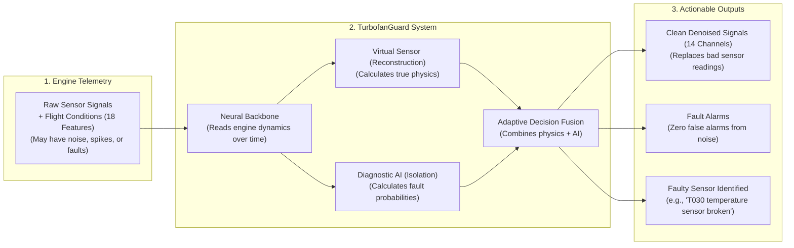

# TurbofanGuard: Documentation Hub

Welcome to the documentation for **TurbofanGuard**, a deep learning system designed to protect aircraft jet engines by detecting faulty sensors, isolating which sensors are broken, and reconstructing clean physical readings in real time.

---

## 1. What is TurbofanGuard? (In Simple Terms)

An aircraft turbofan engine is an extraordinarily complex machine. As an airplane flies, dozens of physical sensors continuously measure temperatures, pressures, shaft rotation speeds, and fuel flow along the engine's gas path. Flight computers and maintenance teams rely on these numbers to keep the flight safe and efficient.

However, physical sensors operate in extreme conditions:
* Vibrations, high heat, and electrical noise can cause **random measurement spikes**.
* Wear-and-tear or calibration loss can cause **slow measurement drifts** (for example, a temperature sensor reading 2 degrees hotter each week).
* Wiring issues or hardware failures can cause **abrupt step jumps** (a sensor suddenly reading 20% too high).

If a flight computer trusts a damaged sensor, it might throttle the engine incorrectly or trigger emergency maintenance when the engine itself is completely fine.

**TurbofanGuard solves this problem.** It acts as an on-wing **Digital Twin** (a virtual computer model that knows exactly how a healthy jet engine should behave). It continuously checks all sensor readings, detects when something goes wrong, identifies which sensor is at fault, and estimates what the true, clean numbers should be.

---

## 2. Documentation Map

The documentation is organized into clear, focused guides. Each guide explains both **what was done** and **why it was done**, with technical terms broken down in simple language.

| Guide | Description | Key Topics Covered |
| :--- | :--- | :--- |
| **[1. Dataset & Ingestion Pipeline](file:///Users/atulyasharan/Documents/TurbofanGuard/docs/dataset_and_pipeline.md)** | Everything about the data used to build and evaluate TurbofanGuard. | The 4 dataset suites (DS01 to DS04), cruise snapshots, 18 input features, 14 clean targets, strict data leakage rules, and the raw Parquet reader. |
| **[2. Data Scaling & Normalization](file:///Users/atulyasharan/Documents/TurbofanGuard/docs/data_scaling.md)** | How raw physical measurements are prepared for neural networks. | Why scaling is mandatory, StandardScaler, zero-leakage training fit, solving the constant feature problem in DS01, and exact inverse transformations. |
| **[3. Neural Backbone Architecture](file:///Users/atulyasharan/Documents/TurbofanGuard/docs/backbone_architecture.md)** | The deep learning 'brain' that extracts engine physics from telemetry. | Multi-scale 1D temporal convolutions (capturing fast spikes vs. slow drifts), temporal pooling, snapshot fallback mode, residual MLP blocks, and the 64D latent state. |
| **[4. Machine Learning Strategy](file:///Users/atulyasharan/Documents/TurbofanGuard/docs/ml_strategy.md)** | The end-to-end strategy for fault detection, isolation, and signal reconstruction. | Analytical redundancy (the connected engine principle), Step 1 Autoencoder vs. Step 2 Dual-Head Network, adaptive thresholding (two-factor authentication for alarms), and evaluation metrics. |
| **[5. Developer & Testing Guide](file:///Users/atulyasharan/Documents/TurbofanGuard/docs/developer_guide.md)** | Practical instructions for running tests, managing configs, and using the codebase. | Project folder structure, running unit test scripts with uv, configuration files, and verification procedures. |

---

## 3. What Has Been Built So Far? (Progress Summary)

Here is a quick summary of what has been implemented, tested, and verified in the repository:

1. **Data Ingestion Pipeline (`src/data/reader.py`)**:
   * Reads high-performance Parquet split files (`train.parquet`, `val.parquet`, `test.parquet`).
   * Loads engine manifests and metadata.
   * Automatically groups columns into clean domain categories (flight conditions, observed sensors, ground-truth clean sensors, and health indices).
   * Passed 100% of unit tests across all dataset suites.

2. **Data Integrity & Leakage Audit (`scripts/audit_data_integrity.py`)**:
   * Verified engine-disjoint splits: Zero engines overlap between training, validation, and test sets.
   * Verified zero missing values: Exactly 0 nulls, 0 NaNs, and 0 infinities across hundreds of thousands of rows.
   * Verified flight cycle continuity: Each engine runs sequentially from cycle 1 to 200 without skips.
   * Isolated 10 internal health indices (`DETA*`, `CW*`) to ensure the neural network only sees realistic, on-wing telemetry.

3. **Feature Scaling Pipeline (`src/data/scaler.py`)**:
   * Standardizes the 18 input features and 14 target features using explicit whitelists.
   * Fits exclusively on the training set to prevent data leakage.
   * Solved the zero-variance problem in DS01 (where cruise conditions are constant) by keeping scale at 1.0, centering features without division-by-zero errors.
   * Inverse transforms normalized network outputs back into real physical units (Kelvin, Pascals, RPM) with less than 0.0001% relative error.
   * Saves and loads scaling parameters to portable JSON files.

4. **Configuration Subsystem (`src/utils/config.py` & `configs/backbone_config.json`)**:
   * Type-safe dataclass configuration with automatic validation for all hyperparameters.
   * Validates layer dimensions, sequence lengths, activation functions, and dropout rates.
   * Saves and loads configurations to JSON.

5. **Shared Neural Backbone (`src/models/backbone.py`)**:
   * A lightweight, high-speed neural network backbone with 57,664 parameters.
   * Employs multi-scale 1D temporal convolutions (kernel sizes 3 and 5) to inspect time windows of flight telemetry.
   * Features temporal pooling that pairs the latest flight snapshot with a historical average.
   * Includes a dedicated snapshot fallback pathway for single-cycle predictions.
   * Built with residual dense layers, Layer Normalization, and GELU non-linear activations.
   * Successfully runs on CPU and Apple Silicon GPU (MPS) acceleration with verified gradient flow.

---

## 4. Key Terminology Glossary

Before diving into the detailed guides, here is a quick reference for common technical terms:

* **Telemetry**: The continuous stream of measurement data sent from aircraft sensors to onboard computers.
* **Cruise Snapshot**: A single snapshot of engine readings taken during stable cruise flight (high altitude, steady speed).
* **Ground Truth**: The true, ideal, clean physical values of the engine, without sensor noise or fault damage.
* **Analytical Redundancy**: Using software and the laws of physics to detect sensor faults by comparing interrelated sensors, rather than installing expensive duplicate hardware sensors.
* **Residual**: The difference between what a physical sensor reports and what the digital twin predicts it should report. If the residual is near zero, the sensor is healthy. If the residual spikes, the sensor is likely broken.
* **Virtual Sensor**: An algorithm that accurately predicts what a sensor should read, acting as a software backup for a damaged physical sensor.
* **Fault Detection**: Answering the yes-or-no question: "Is any sensor currently failing on this engine?"
* **Fault Isolation**: Answering the specific question: "Which exact sensor (or sensors) is broken?"
* **Data Leakage**: An accidental mistake in machine learning where information from the test set or future states is leaked into the training set, causing the model to look artificially good during training but fail in the real world.
* **Latent State ($z_t$)**: A compact, compressed set of numbers (in our case, 64 numbers) that captures the core physical health and thermodynamic state of the engine.
