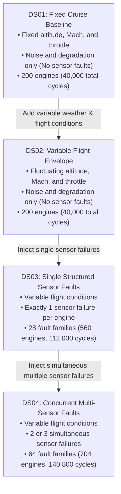
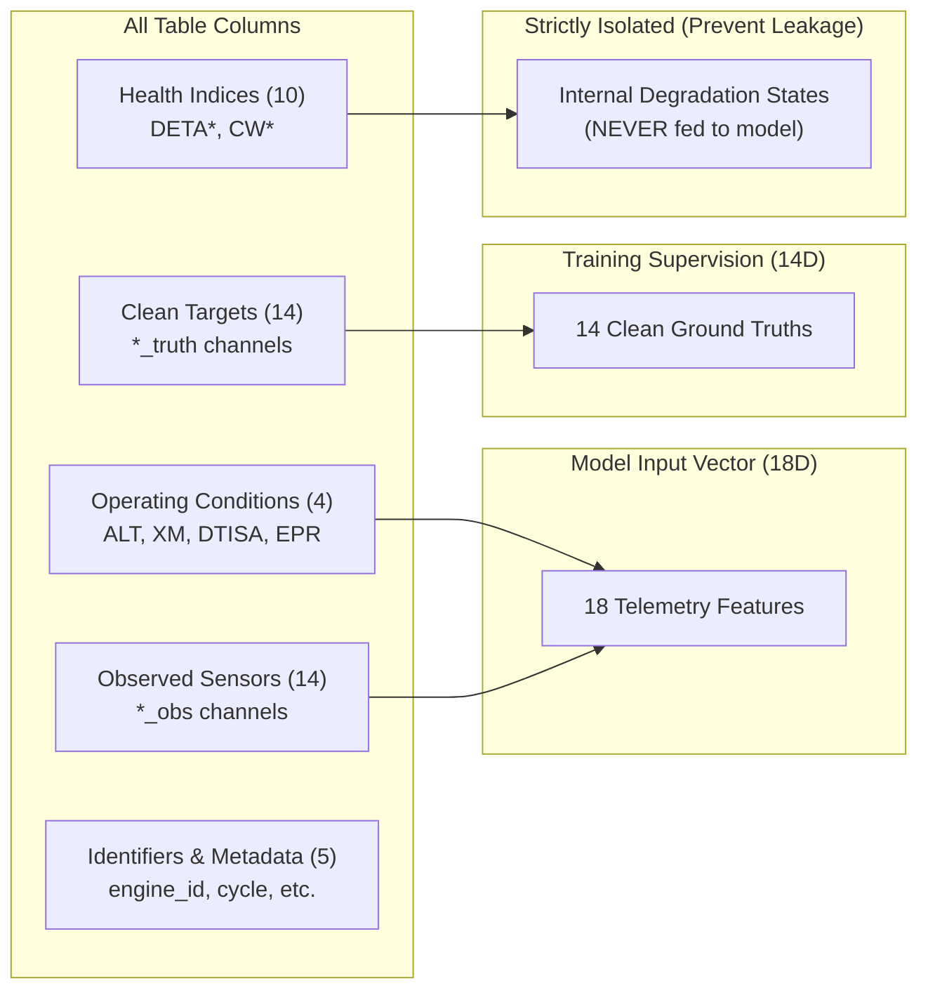
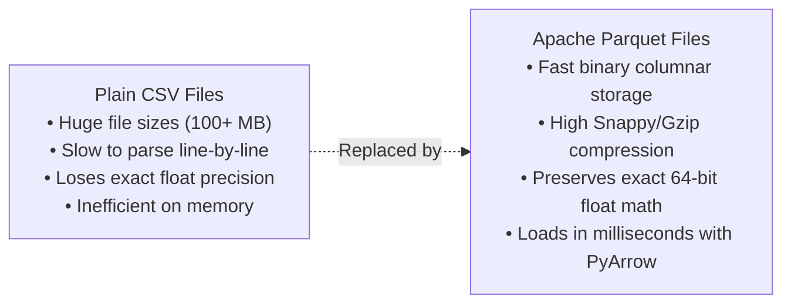

# TurbofanGuard: Dataset & Ingestion Pipeline

This document explains the data behind TurbofanGuard, how the dataset is structured, why each data choice was made, and how the raw data ingestion pipeline works.

---

## 1. What is the Dataset?

TurbofanGuard is built on the **Turbofan Sensor-FDI-Bench** dataset, a benchmark created by aerospace researchers for the 9th European Conference of the Prognostics and Health Management (PHM) Society (2026, Oslo).

### Why Was a Synthetic Benchmark Created?
In the real world, commercial airlines cannot intentionally break engine sensors during passenger flights to collect training data. Doing so would be dangerous and costly. Real maintenance records also suffer from incomplete labels or missing flight conditions.

To solve this, researchers used advanced thermodynamic engine simulation software to generate synthetic, physics-accurate data. The simulation models realistic commercial aircraft turbofan engines during flight cruise, including:
* Realistic flight variations (changing altitude, airspeed, and throttle).
* Natural, slow component degradation over hundreds of flights (engine parts gradually wear out).
* Realistic sensor telemetry noise (random electrical vibrations and occasional spikes).
* Carefully injected sensor faults (gradual drifts and abrupt jumps).

---

## 2. Sampling Convention: Cruise Snapshots

Each row in the dataset represents **one engine cruise snapshot taken during one flight cycle**.

```text
Flight 1  ──> [Snapshot at stabilized cruise] ──> Row 1 in Parquet
Flight 2  ──> [Snapshot at stabilized cruise] ──> Row 2 in Parquet
...
Flight 200 ──> [Snapshot at stabilized cruise] ──> Row 200 in Parquet
```

* **What is a Cruise Snapshot?** When an airplane takes off and climbs, the engine experiences large, rapid changes. Once the plane reaches its cruising altitude (typically 30,000 to 38,000 feet) and levels off at a steady speed, the engine enters a stable thermodynamic state. Taking a single averaged snapshot at this quiet point allows algorithms to evaluate the true health of the engine without being confused by rapid pilot throttle movements.
* **Flight Cycles**: Each engine in the dataset flies for exactly **200 consecutive flight cycles**. This provides a 200-step timeline of an engine's life, showing how its health evolves over time.

---

## 3. The Four Dataset Suites (DS01 to DS04)

The benchmark is organized into four distinct suites. Each suite tests a specific challenge in sensor fault detection, progressing from simple baseline conditions to complex multi-sensor failures.



### Detailed Suite Breakdown

| Suite | Flight Envelope Conditions | Fault Types Present | Number of Engines | Purpose in TurbofanGuard |
| :--- | :--- | :--- | :--- | :--- |
| **`DS01`** | **Fixed**: Altitude = 10,668 m (35,000 ft), Mach = 0.78, Throttle (EPR) = 1.8118, Temp Dev = 0 K | Only background noise and peak spikes (Engines are healthy) | 200 engines (40,000 cycles) | **Sanity Check & Prototyping**: Allows us to verify our models in an environment where flight conditions do not change. |
| **`DS02`** | **Variable**: Altitude, Mach, throttle, and ambient temperature fluctuate across flights | Only background noise and peak spikes (Engines are healthy) | 200 engines (40,000 cycles) | **Core Training Foundation**: Teaches our neural network the clean, healthy laws of turbofan thermodynamics across all flying conditions. |
| **`DS03`** | **Variable**: Full flight variability | **Single Sensor Faults**: Exactly one sensor breaks per engine (either a slow drift or a sudden step jump) | 560 engines (112,000 cycles) | **Single-Fault FDI Benchmark**: Evaluates how quickly and accurately the system detects and isolates individual sensor failures. |
| **`DS04`** | **Variable**: Full flight variability | **Multi-Sensor Faults**: Combinations of 2 or 3 sensors failing at the same time | 704 engines (140,800 cycles) | **Stress Test**: Evaluates whether the system can isolate multiple broken sensors without getting confused by cross-talk. |

---

## 4. Complete Feature Breakdown (The Telemetry Channels)

Each flight snapshot contains up to 47 columns. In TurbofanGuard, we categorize these columns into five distinct functional groups.



### Group 1: Flight Operating Conditions (4 Features)
These four numbers describe the external environment and pilot commands at the moment the snapshot was taken:
1. **`ALT` (Altitude)**: Height of the aircraft above sea level in meters (baseline is 10,668 meters, or 35,000 feet). Higher altitudes have thinner, colder air.
2. **`XM` (Flight Mach Number)**: Airspeed of the plane relative to the speed of sound (dimensionless, baseline is 0.78 Mach).
3. **`DTISA` (Delta International Standard Atmosphere)**: Ambient air temperature deviation from the standard atmospheric profile in Kelvin. Tells the model if it is flying on a warm summer day or a frigid winter day.
4. **`EPR` (Engine Pressure Ratio)**: The primary throttle command (ratio of turbine exhaust pressure to fan inlet pressure, baseline is 1.8118). Higher EPR means the pilot is demanding more thrust.

### Group 2: Observed Sensor Channels (`*_obs`, 14 Channels)
These are the raw physical measurements collected by instruments on the engine. They contain electrical noise, random spikes, and potential sensor failures:
1. **`NH_obs`**: High-Pressure Spool rotational speed (RPM). Measures how fast the inner turbine core is spinning.
2. **`NL_obs`**: Low-Pressure Spool rotational speed (RPM). Measures how fast the big front fan is spinning.
3. **`WFE_obs`**: Fuel Flow Rate (kilograms per second). Measures how much jet fuel is burning in the combustor.
4. **`PS0_obs`**: Ambient Static Pressure (Pascals).
5. **`P2_obs`**: Total Pressure at the Fan Inlet.
6. **`P023_obs`**: Total Pressure at the Booster/LPC Outlet.
7. **`P030_obs`**: Total Pressure at the High-Pressure Compressor (HPC) Outlet.
8. **`P044_obs`**: Total Pressure at the High-Pressure Turbine (HPT) Inlet.
9. **`P050_obs`**: Total Pressure at the Low-Pressure Turbine (LPT) Exit.
10. **`P134_obs`**: Total Pressure in the Bypass Duct.
11. **`T2_obs`**: Total Temperature at the Fan Inlet (Kelvin).
12. **`T023_obs`**: Total Temperature at the Booster Outlet (Kelvin).
13. **`T030_obs`**: Total Temperature at the HPC Outlet (Kelvin).
14. **`T050_obs`**: Exhaust Gas Temperature (EGT) at the LPT Exit (Kelvin). This is a critical indicator of engine heat stress.

### Group 3: Clean Ground-Truth Targets (`*_truth`, 14 Channels)
These 14 channels correspond directly to the observed sensors, but represent the **ideal, clean physical truth** calculated by the thermodynamic simulator. They have zero measurement noise, zero spikes, and zero sensor fault offsets.
* During model training, the network's predictions are compared against these clean truth targets so the model learns how to denoise and reconstruct clean physical signals.

### Group 4: Internal Degradation Health Indices (10 Channels)
These columns start with `DETA` (efficiency loss) or `CW` (flow capacity degradation) across engine sub-components:
* Fan degradation (`DETA024`, `CW024`)
* Booster compressor degradation (`DETA120`, `CW120`)
* High-pressure compressor degradation (`DETA026`, `CW026`)
* High-pressure turbine degradation (`DETA040`, `CW040`)
* Low-pressure turbine degradation (`DETA044`, `CW044`)

> [!IMPORTANT]
> **Strict Isolation (Zero Data Leakage Rule)**:
> In a real operational aircraft, an airline cannot measure the internal blade wear or aerodynamic efficiency of an engine turbine while flying through the air. These 10 health indices exist only inside the physics simulator. If we passed these columns into the neural network, the model would cheat by looking at the hidden answers instead of learning from actual sensor telemetry. Therefore, **these 10 health columns are strictly isolated and excluded from model inputs**.

### Group 5: Identifiers and Metadata
* **`suite_id`**: Identifies the dataset suite (`DS01`, `DS02`, `DS03`, `DS04`).
* **`engine_id`**: Unique serial number for each simulated engine.
* **`flight_cycle`**: Flight counter for that engine (ranges from 1 to 200).
* **`fault_id`**: Categorical identifier indicating which fault family was simulated.
* **`fault_on`**: Binary indicator (0 or 1) showing whether the sensor fault is currently active on that flight cycle.

---

## 5. Why Parquet Format?

All dataset splits are stored as `.parquet` files (`train.parquet`, `val.parquet`, `test.parquet`). Here is why Parquet was chosen instead of plain `.csv` text files:



1. **Columnar Storage**: In a machine learning pipeline, we often want to read only the 18 input features and 14 targets. Parquet reads individual columns directly without having to parse every line of the file, making data loading up to 10 times faster.
2. **Exact Numerical Precision**: CSV stores numbers as text strings (e.g. `"691.348215"`), which causes rounding errors when converted back and forth. Parquet preserves the exact IEEE 64-bit binary floating-point representations.
3. **Storage Efficiency**: Built-in columnar compression reduces disk footprint significantly while loading into memory in fractions of a second.

---

## 6. Data Integrity & Leakage Audit

Before training any neural network, we wrote and executed an automated audit script (`scripts/audit_data_integrity.py`) to verify the health and integrity of all files. The audit confirmed four critical properties:

### 1. Engine-Disjoint Splits (Zero Identity Leakage)
A common beginner flaw in time-series machine learning is randomly shuffling rows across train and test sets. If flight cycle 10 of Engine #12 is in the training set and cycle 11 of Engine #12 is in the test set, the model memorizes that specific engine's baseline instead of learning general engine physics.

Our audit verified that engines are strictly divided into mutually exclusive sets:
```math
\text{Engines}_{\text{train}} \cap \text{Engines}_{\text{val}} = \emptyset, \quad \text{Engines}_{\text{train}} \cap \text{Engines}_{\text{test}} = \emptyset, \quad \text{Engines}_{\text{val}} \cap \text{Engines}_{\text{test}} = \emptyset
```
* **Plain English**: There is zero overlap between the engines used to train the model, validate the model, and test the model.
* In `DS01`: 140 engines for training, 30 for validation, 30 for testing (Total: 200 engines).
* In `DS03`: 392 engines for training, 84 for validation, 84 for testing (Total: 560 engines).

### 2. Zero Missing or Corrupt Values
The audit scanned all 40,000 rows of DS01 and 112,000 rows of DS03 across all 47 columns:
* **Null count**: Exactly 0.
* **NaN (Not a Number) count**: Exactly 0.
* **Infinite value count**: Exactly 0.

### 3. Sequential Flight Continuity
The audit checked the timeline of every single engine:
* Every engine starts at cycle 1 and completes at cycle 200.
* Flight cycles are 100% sequential and monotonic with zero dropped or out-of-order flights.

---

## 7. How `src/data/reader.py` Works

The data reader module provides clean, lightweight functions to access the dataset without applying any destructive transformations.

### Key Functions

1. **`load_suite_split(suite_name, split='train')`**:
   * Loads the specified Parquet file for any suite (`DS01`, `DS02`, `DS03`, `DS04`) and split (`train`, `val`, `test`).
   * Returns a clean Pandas DataFrame.

2. **`load_manifests(suite_name)`**:
   * Loads the accompanying `engine_manifest.csv` and `suite_metadata.json`.
   * Tells you which sensor is broken for each engine in `DS03` and `DS04`, the fault start cycle, the fault type (drift or step), and the severity magnitude.

3. **`get_column_groups(df)`**:
   * Inspects the columns of the loaded DataFrame and automatically organizes them into clean Python lists:
     * `conditions`: The 4 operating conditions.
     * `sensors_obs`: The 14 observed sensor channels.
     * `sensors_truth`: The 14 clean target channels.
     * `health_indices`: The 10 isolated internal degradation states.
     * `input_features`: The combined 18 features (conditions + observed sensors) that feed into our models.
     * `metadata`: The identifier columns (`engine_id`, `flight_cycle`, etc.).

4. **`get_split_summary(df)`**:
   * Produces a quick summary dictionary showing row counts, unique engines, cycle ranges, and feature counts.

---

## 8. Summary: Pipeline Inputs & Outputs

```math
\text{Model Input } \mathbf{x}_t \in \mathbb{R}^{18} = \begin{bmatrix} \text{ALT}_t \\ \text{XM}_t \\ \text{DTISA}_t \\ \text{EPR}_t \\ \text{Sensor}_1^{\text{obs}} \\ \vdots \\ \text{Sensor}_{14}^{\text{obs}} \end{bmatrix}, \quad \text{Clean Target } \mathbf{y}_t^* \in \mathbb{R}^{14} = \begin{bmatrix} \text{Sensor}_1^{\text{truth}} \\ \vdots \\ \text{Sensor}_{14}^{\text{truth}} \end{bmatrix}
```

* **In Plain English**: At each flight cycle, the system takes in an 18-element vector (4 flight environment variables + 14 raw sensor readings) and learns to predict a 14-element vector (the true, uncorrupted physical state of all 14 sensors).
