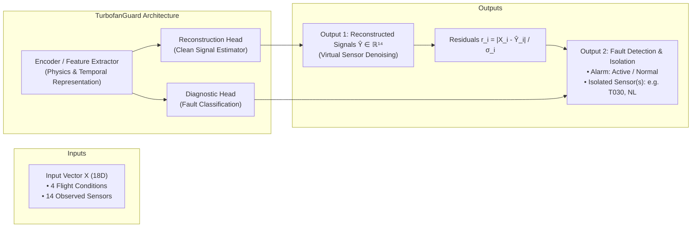
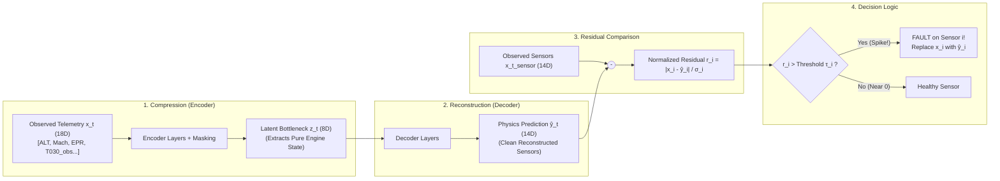
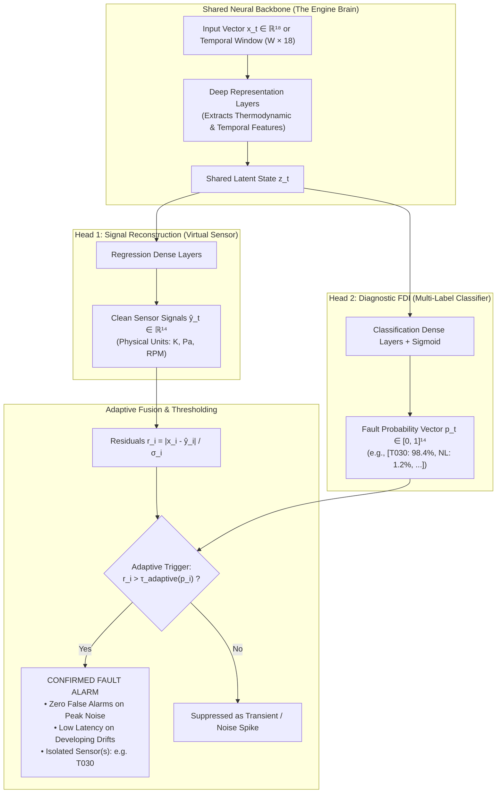
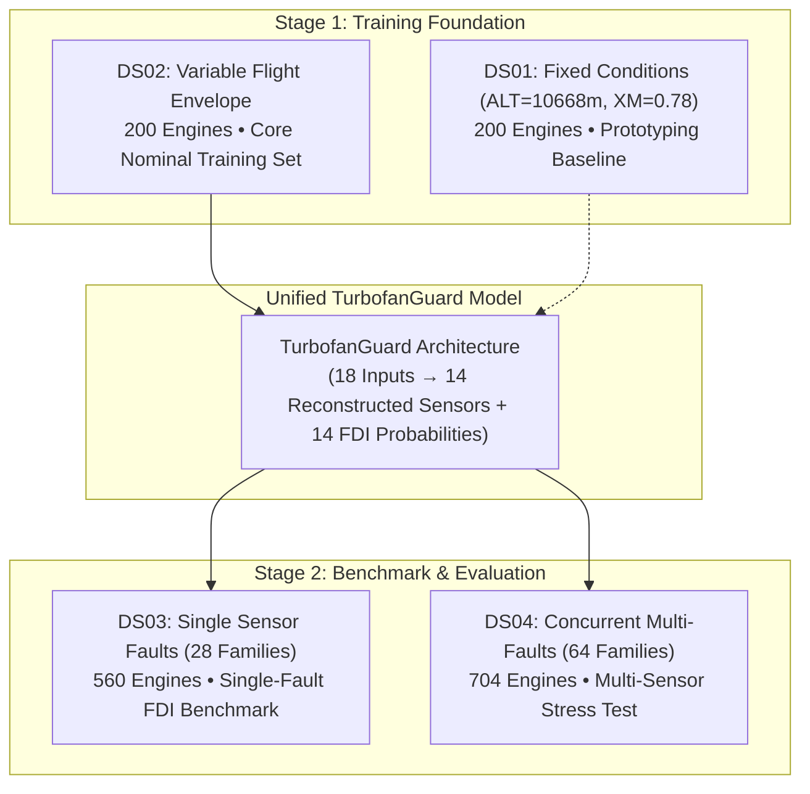

# TurbofanGuard: Machine Learning Architecture Strategy

## 1. Executive Summary & System Vision

**TurbofanGuard** is an end-to-end Fault Detection, Isolation (FDI), and Signal Reconstruction pipeline for turbofan jet engines operating under real-world performance degradation and flight variability.

When deployed on an engine's continuous telemetry stream, the system solves three simultaneous objectives:
1. **Fault Detection**: Determine whether an anomaly or sensor failure has occurred ($\text{Healthy} \to 0, \text{Faulty} \to 1$).
2. **Fault Isolation**: Identify precisely **which** of the 14 sensors is malfunctioning (e.g. *"Sensor $T_{030}$ has a $+2\%$ linear drift"* or concurrent multi-sensor failures).
3. **Signal Reconstruction (Virtual Sensing)**: Estimate the clean, uncorrupted thermodynamic truth $\hat{\mathbf{y}}_t \in \mathbb{R}^{14}$ to replace damaged measurements, allowing the flight control computer and maintenance crew to operate safely.



---

## 2. Mathematical Formulation

### 2.1 Input Feature Space ($\mathbf{x}_t \in \mathbb{R}^{18}$)

At each discrete flight cycle $t \in \{1, \dots, 200\}$, the engine telemetry provides an 18-dimensional input vector:

```math
\mathbf{x}_t = \begin{bmatrix} \mathbf{c}_t \\ \mathbf{x}_t^{\text{sensor}} \end{bmatrix} \in \mathbb{R}^{18}
```

Where:

#### 1. Operating Conditions ($\mathbf{c}_t \in \mathbb{R}^4$)
Defines the thermodynamic ambient environment and pilot command:

```math
\mathbf{c}_t = \begin{bmatrix} \text{ALT}_t & \text{XM}_t & \text{DTISA}_t & \text{EPR}_t \end{bmatrix}^\top
```

* **$\text{ALT}_t$**: Altitude in meters (baseline cruise: 10,668 m / 35,000 ft)
* **$\text{XM}_t$**: Flight Mach number (baseline cruise: 0.78)
* **$\text{DTISA}_t$**: Temperature deviation from international standard atmosphere ($\Delta T_{\text{ISA}}$ in Kelvin)
* **$\text{EPR}_t$**: Engine Pressure Ratio (primary throttle command, baseline cruise: 1.8118)

#### 2. Observed Sensor Measurements ($\mathbf{x}_t^{\text{sensor}} \in \mathbb{R}^{14}$)
Telemetry subject to random measurement noise, peak spikes, and potential sensor fault injections:

```math
\mathbf{x}_t^{\text{sensor}} = \mathbf{y}_t^* + \boldsymbol{\epsilon}_t + \mathbf{f}_t
```

* **$\mathbf{y}_t^* \in \mathbb{R}^{14}$**: The true, uncorrupted thermodynamic engine state (clean signal).

**Telemetry Noise Model ($\boldsymbol{\epsilon}_t$)**:  
Telemetry is corrupted by a composite noise process:

```math
\boldsymbol{\epsilon}_t = \boldsymbol{\eta}_t + \mathbf{p}_t
```

where $\boldsymbol{\eta}_t \sim \mathcal{N}(\mathbf{0}, \boldsymbol{\Sigma}_t)$ is zero-mean Gaussian measurement noise with channel-specific standard deviation subject to random scale expansion ($1.0\times$ to $3.0\times$), and $\mathbf{p}_t$ represents sparse peak anomalies occurring with ~1% probability with magnitudes spanning $1.0\sigma$ to $10.0\sigma$.

**Sensor Fault Injection Vector ($\mathbf{f}_t \in \mathbb{R}^{14}$)**:  
For healthy flight cycles ($t < t_{\text{start}}$):

```math
\mathbf{f}_t = \mathbf{0}
```

For a sensor $i$ experiencing a fault starting at flight cycle $t_{\text{start}}$:

* **Linear Drift**:
```math
\mathbf{f}_t[i] = k_i \cdot (t - t_{\text{start}}) \quad (t \ge t_{\text{start}})
```

* **Exponential / Non-Linear Drift**:
```math
\mathbf{f}_t[i] = \text{sign}_i \cdot \alpha_i \cdot (t - t_{\text{start}})^{\beta_i} \quad (t \ge t_{\text{start}}, \; \beta_i \in [2.0, 5.0])
```

* **Abrupt Step / Bias**:
```math
\mathbf{f}_t[i] = b_i \cdot \mathbb{I}(t \ge t_{\text{start}})
```

* **Rapid-Growth Step**: Multi-flight ramp starting at $t_{\text{start}}$ reaching asymptote $b_i$ over $\Delta t_{\text{growth}} \in [2, 6]$ flight cycles.

> [!IMPORTANT]
> **Strict Isolation of Latent Health Indices (Zero Target Leakage)**:
> The dataset records 10 internal degradation health states (`DETA024`, `CW024`, `DETA120`, `CW120`, `DETA026`, `CW026`, `DETA040`, `CW040`, `DETA044`, `CW044`). In real operational jet engines, component efficiency degradation ($\Delta \eta$) and flow capacity change ($CW$) cannot be directly instrumented during flight. They are strictly isolated and excluded from model inputs $\mathbf{x}_t$ to prevent data leakage.

---

### 2.2 Target Space & Data Schema

* **Reconstruction Target**: The clean physics vector $\mathbf{y}_t^* \in \mathbb{R}^{14}$ (`*_truth` channels: `NH_truth`, `NL_truth`, `WFE_truth`, `PS0_truth`, `P2_truth`, `P023_truth`, `P030_truth`, `P044_truth`, `P050_truth`, `P134_truth`, `T2_truth`, `T023_truth`, `T030_truth`, `T050_truth`).
* **Isolation Target**: A multi-hot binary indicator vector $\mathbf{m}_t \in \{0, 1\}^{14}$, where $m_{t, i} = 1$ if sensor $i$ is actively faulty at flight cycle $t$.

#### Suite Schema Mapping:
The ground-truth isolation vector $\mathbf{m}_t$ is dynamically constructed across suites:
* **`DS01` & `DS02`**: All cycles are nominal: $\mathbf{m}_t = \mathbf{0} \in \{0\}^{14}$.
* **`DS03` (Single Faults)**: Parquet provides scalar `fault_on \in \{0, 1\}`. When `fault_on == 1`, $m_{t, i} = 1$ strictly for sensor $i = \text{affected\_sensor}$ from `family_manifest.csv`.
* **`DS04` (Multi-Faults)**: Parquet provides separate activation flags `fault_a_on`, `fault_b_on`, and `fault_c_on`. When active, corresponding sensor channels from `fault_a_measurement`, `fault_b_measurement`, and `fault_c_measurement` (from `engine_manifest.csv`) are set to 1.

---

## 3. The Two-Step Architectural Strategy

Rather than deploying an opaque black-box classifier, TurbofanGuard follows a structured two-step roadmap:

```text
Step 1: Baseline Denoising Autoencoder / Virtual Sensor (Physics Residual FDI)
   └── Concept: "Virtual Sensing via Analytical Redundancy"
   └── Training: Supervised denoising on nominal flights only (DS01 & DS02)
   └── Supervision: Clean targets y* (zero fault labels required during training)
   └── Output: Denoised virtual signals ŷ + anomaly detection via physical residual spikes

Step 2: Dual-Head Multi-Task Network (Physics + Diagnostic AI)
   └── Concept: "Two-Factor Authentication for Sensor Alarms"
   └── Training: End-to-end multi-task on nominal + faulted data (DS02, DS03, DS04)
   └── Head 1 (Reconstruction): Estimates continuous physical sensor values (K, Pa, RPM)
   └── Head 2 (Diagnostic FDI): Outputs multi-label fault probabilities per sensor (0% to 100%)
   └── Decision: Dynamic thresholding fusing physical residuals with AI confidence
```

---

### The Foundational Principle: "Analytical Redundancy"

To understand why this strategy works, consider how an aircraft jet engine functions:

> **The Engine is a Coupled Thermodynamic Machine**:
> Gas turbine operation is governed by strict laws of thermodynamics (conservation of mass, energy, and momentum). When a pilot advances the throttle command (`EPR` rises):
> * Fuel flow (`WFE`) **must** increase.
> * High-pressure spool speed (`NH`) and low-pressure spool speed (`NL`) **must** accelerate.
> * Pressures along the gas path (`P023`, `P030`, `P044`, `P050`) **must** climb in deterministic ratios.
> * Gas temperatures (`T023`, `T030`, `T050`) **must** follow predictable thermodynamic gradients.

**No sensor exists in isolation.** In traditional aviation, reliability was achieved through **Hardware Redundancy** (installing 2 or 3 duplicate physical sensors on each station). However, duplicate hardware adds structural weight, cabling, maintenance burden, and additional points of failure.

**TurbofanGuard achieves "Analytical (Software) Redundancy"**:
By learning the thermodynamic coupling across all 14 sensors and 4 flight conditions, the neural network acts as an on-wing **Digital Twin**. If 13 sensors and the flight conditions indicate standard cruise conditions, but sensor $T_{030}$ reports $740\,\text{K}$ instead of the physical $691\,\text{K}$, the analytical residual exposes that **the engine thermodynamic cycle is normal, but sensor $T_{030}$ is faulty**.

---

### Step 1: Baseline Denoising Autoencoder (Physics-Informed Residual FDI)

Step 1 employs **supervised denoising regression on nominal flights**. Because it is trained exclusively on healthy data (`DS01` and `DS02`), it requires **zero fault labels** to train, functioning as an unsupervised anomaly detector during deployment.



#### 1. The Information Bottleneck & Robust Encoding
* The network compresses **18 input features** through a narrow **latent bottleneck** (e.g. 8 dimensions).
* **Physical Justification**: For a twin-spool turbofan operating at stabilized cruise, the thermodynamic cycle is governed by approximately 4 to 6 primary degrees of freedom (ambient altitude, Mach, ambient temperature, throttle setting, and component degradation states).
* **Latent Robustness via Channel Masking**: To prevent large sensor faults (e.g. a $+10\sigma$ step jump) from corrupting the latent bottleneck $\mathbf{z}_t$ and smearing residual errors across healthy sensors during inference, the encoder is trained with **random channel masking / denoising augmentation** (randomly zeroing or perturbing 1–2 sensor channels during training). This forces the bottleneck to derive state estimates from operating conditions and remaining uncorrupted sensors.

#### 2. Training Objective: Supervised Denoising on Nominal Flights
* **Training Data**: Trained strictly on healthy flight cycles from `DS02` (variable conditions) and `DS01` (fixed baseline).
* **Loss Function**: Mean Squared Error (or smooth Huber loss) between model estimates $\hat{\mathbf{y}}_t$ and the true thermodynamic values $\mathbf{y}_t^*$:
```math
\mathcal{L}_{\text{recon}}(\theta) = \frac{1}{B \cdot 14} \sum_{b=1}^B \sum_{i=1}^{14} \left( \hat{y}_{b, i} - y_{b, i}^* \right)^2
```
* **Intuition**: The model learns nominal aerothermal relationships across the flight envelope. It does not need prior examples of sensor faults to detect when a sensor violates physics.

#### 3. Real-Time Inference: Normalized Residuals
During flight, the model continuously calculates the discrepancy between reported telemetry and virtual sensor predictions:

```math
r_{t, i} = \frac{|x_{t, i}^{\text{sensor}} - \hat{y}_{t, i}|}{\sigma_{i, \text{nominal}}}
```

Where $\sigma_{i, \text{nominal}}$ is the standard deviation of healthy baseline residual noise for sensor $i$.

* **Healthy Nominal Operation**: The residual remains below threshold:
```math
x_{t, i} \approx \hat{y}_{t, i} \implies r_{t, i} < \tau_i \quad (\text{typically } \tau_i \in [3.5, 4.5]\sigma)
```

* **Sensor Failure (e.g. $+3\%$ Drift or Step Jump on $T_{030}$)**:  
Operating conditions and the remaining 13 sensors confirm standard cruise ($\hat{y}_{T030} = 691\,\text{K}$), but the sensor reports a faulty value ($x_{T030} = 740\,\text{K}$). Only $r_{T030}$ spikes (e.g. to $+15\sigma$), while other residuals remain flat below threshold.

#### 4. The 3-in-1 Output of Step 1:
1. **Detection**: An alarm triggers if $\max_i(r_{t, i}) > \tau_{\text{det}}$.
2. **Isolation**: Faulty sensor is isolated via $\arg\max_i(r_{t, i})$ (or all sensors where $r_{t, i} > \tau_i$).
3. **Signal Reconstruction**: Flight systems substitute the corrupted reading with virtual prediction $\hat{y}_{t, i}$.

---

### Step 2: Dual-Head Multi-Task Architecture (Physics + Diagnostic AI)

While Step 1 is interpretable and effective, relying solely on static residual thresholds faces practical tradeoffs:
1. **False Alarms from Peak Noise**: Sparse $10\sigma$ noise spikes can momentarily breach a static threshold $\tau_i$.
2. **Detection Latency on Subtle Drifts**: Slow drifts take 30–50 flight cycles to exceed a conservative threshold $\tau_i \approx 4.0\sigma$.
3. **Concurrent Multi-Faults (`DS04`)**: When 2 or 3 sensors fail concurrently, physical isolation requires joint probability estimation.

Step 2 resolves this with a **Dual-Head Multi-Task Network** that couples physics estimation with an AI diagnostic classifier.



#### 1. Architectural Components

* **Temporal Sequence Windowing ($W \times 18$)**:  
To enable Head 2 to recognize **drift slopes**, detect **growth rates**, and distinguish developing faults from isolated single-cycle peak spikes, the backbone takes a sliding window of recent flight cycles (e.g. $W = 10\text{–}30$ cycles) processed by a 1D-CNN, GRU, or Temporal MLP.

* **Head 1: Continuous Signal Reconstruction**:  
Estimates exact physical sensor signals in Pascals, Kelvin, and RPM:
```math
\hat{\mathbf{y}}_t = g_{\text{recon}}(\mathbf{z}_t) \in \mathbb{R}^{14}
```

* **Head 2: Multi-Label Fault Classification**:  
Outputs 14 independent sigmoid probabilities indicating fault presence for each sensor channel, supporting single-fault (`DS03`) and concurrent multi-fault (`DS04`) isolation:
```math
\mathbf{p}_t = \sigma\left( g_{\text{diag}}(\mathbf{z}_t) \right) \in [0, 1]^{14}
```

#### 2. Dynamic Thresholding & Decision Fusion
To eliminate the latency penalty of rigid boolean logic while suppressing peak-noise false alarms, TurbofanGuard applies **Adaptive Residual Thresholding**:

```math
\text{Trigger Alarm on Sensor } i \iff r_{t, i} > \tau_{\text{adaptive}}(p_{t, i})
```

Where the required residual threshold dynamically adapts based on diagnostic confidence:

```math
\tau_{\text{adaptive}}(p_{t, i}) = \tau_{\text{high}} - (\tau_{\text{high}} - \tau_{\text{low}}) \cdot p_{t, i}
```

* **Nominal Baseline**: When $p_{t, i} \approx 0$, threshold remains at $\tau_{\text{high}} = 4.5\sigma$, completely suppressing single-cycle $10\sigma$ peak noise spikes.
* **Developing Subtle Drift**: As Head 2 detects multi-cycle upward trend signatures ($p_{t, i} > 0.8$), the residual threshold automatically relaxes to $\tau_{\text{low}} = 2.0\sigma$, triggering a confirmed alarm with **minimal detection latency**.

#### 3. Joint Multi-Task Loss Formulation
```math
\mathcal{L}_{\text{total}} = \mathcal{L}_{\text{recon}} + \lambda \cdot \mathcal{L}_{\text{FDI}}
```

Where:
* $\mathcal{L}_{\text{recon}}$ is the Mean Squared Error (or Smooth L1) on sensor reconstruction:
```math
\mathcal{L}_{\text{recon}} = \frac{1}{14} \sum_{i=1}^{14} (\hat{y}_{t, i} - y_{t, i}^*)^2
```

* $\mathcal{L}_{\text{FDI}}$ is Multi-Label Binary Cross-Entropy with positive class weighting to handle fault class imbalance:
```math
\mathcal{L}_{\text{FDI}} = -\frac{1}{14} \sum_{i=1}^{14} \left[ w_{\text{pos}} \cdot m_{t, i} \log(p_{t, i}) + (1 - m_{t, i}) \log(1 - p_{t, i}) \right]
```

* $\lambda > 0$ balances gradient magnitudes between regression and classification branches.

---

### Step 1 vs. Step 2 Comparison

| Attribute | Step 1: Baseline Autoencoder | Step 2: Dual-Head Multi-Task Network |
| :--- | :--- | :--- |
| **Model Type** | Denoising Regressor / Virtual Sensor | Multi-Task Deep Sequence Network |
| **Input Format** | Single flight cycle snapshot ($1 \times 18$) | Sliding temporal window ($W \times 18$) |
| **Supervision Level** | Supervised on clean physics $\mathbf{y}^*$; **unsupervised for faults** | Supervised on clean physics $\mathbf{y}^*$ + fault labels $\mathbf{m}_t$ |
| **Training Suites** | `DS02` (variable conditions) & `DS01` | `DS02` (nominal) + `DS03` (single faults) + `DS04` (multi-faults) |
| **Evaluation Suites** | Evaluated on `DS03` & `DS04` | Evaluated on test splits of `DS03` & `DS04` |
| **Decision Rule** | Static residual threshold ($r_i > \tau_i$) | Adaptive thresholding: $r_i > \tau_{\text{adaptive}}(p_i)$ |
| **Peak Noise Resilience** | Moderate (requires post-residual filtering) | **High** (diagnostic classifier rejects single-cycle spikes) |
| **Multi-Fault Capability** | Effective on double faults; sensitive on triple faults | **High** (explicit multi-label output with mutual feature extraction) |
| **Interpretability** | Physical residual curves (Kelvin, Pascals, RPM) | Physical residual curves + AI diagnostic confidence scores |

---

## 4. Dataset Suite Progression & Lifecycle

TurbofanGuard utilizes all four benchmark suites in a structured development and evaluation lifecycle:



### Dataset Suite Progression Table

| Suite | Flight Envelope Conditions | Fault Modes Present | Engine Count | Primary Role in Pipeline |
| :--- | :--- | :--- | :--- | :--- |
| **`DS01`** | Fixed (ALT=10,668 m, XM=0.78, DTISA=0, EPR=1.8118) | None (Noise + component degradation) | 200 | **Architecture Prototyping**: Validates network convergence without operating condition variance. |
| **`DS02`** | **Variable** (ALT, Mach, DTISA, EPR fluctuate) | None (Noise + component degradation) | 200 | **Core Nominal Training**: Teaches the model healthy aerothermodynamics across the entire flight envelope. |
| **`DS03`** | **Variable** | **Single Faults** (14 drift families, 14 step families) | 560 | **Single-Fault FDI Benchmark**: Evaluates detection latency, false alarm rate, and single-channel isolation. |
| **`DS04`** | **Variable** | **Concurrent Multi-Faults** (48 double-fault, 16 triple-fault families) | 704 | **Multi-Fault Generalization**: Benchmarks simultaneous isolation of multiple failing sensors without residual cross-talk. |

---

## 5. Performance Evaluation Metrics

TurbofanGuard is evaluated using standardized aerospace and machine learning metrics:

### 1. Denoising & Signal Reconstruction Metrics

* **Root Mean Squared Error (RMSE)**:
```math
\text{RMSE}_i = \sqrt{\frac{1}{N} \sum_{t=1}^N (\hat{y}_{t, i} - y_{t, i}^*)^2}
```

* **Mean Absolute Percentage Error (MAPE)**:
```math
\text{MAPE}_i = \frac{100\%}{N} \sum_{t=1}^N \left| \frac{\hat{y}_{t, i} - y_{t, i}^*}{y_{t, i}^*} \right|
```

### 2. Fault Detection & Isolation (FDI) Metrics

* **False Alarm Rate (FAR / FPR)**: Fraction of healthy cycles ($t < t_{\text{start}}$ in DS03/DS04, and all cycles in DS01/DS02) that trigger an alarm:
```math
\text{FAR} = \frac{\text{False Alarms in Nominal Cycles}}{\text{Total Nominal Cycles}} \quad (\text{Target: } < 1.0\%)
```

* **True Positive Rate (TPR / Recall)**: Fraction of active fault cycles ($t \ge t_{\text{start}}$) correctly detected:
```math
\text{TPR} = \frac{\text{Detected Fault Cycles}}{\text{Total Active Fault Cycles}} \quad (\text{Target: } > 95\%)
```

* **Detection Latency ($\Delta t_{\text{det}}$)**: Number of flight cycles between fault onset and first confirmed alarm (conditioned on detection):
```math
\Delta t_{\text{det}} = t_{\text{first\_alarm}} - t_{\text{fault\_start}}
```

* **Single-Fault Isolation Accuracy (`DS03`)**:
```math
\text{Acc}_{\text{iso}} = \frac{\text{Correctly Isolated Faulty Sensors}}{\text{Total Fault Injections}}
```

* **Multi-Label Isolation Metrics (`DS04`)**:
  * **Exact Match Ratio (Subset Accuracy)**: Percentage of cycles where all 14 sensor health states are perfectly classified: $\mathbb{I}(\hat{\mathbf{m}}_t = \mathbf{m}_t)$.
  * **Multi-Label Macro F1-Score**: Harmonic mean of precision and recall evaluated independently per sensor channel and averaged.
  * **Hamming Loss**: Fraction of sensor labels incorrectly classified.

---

## 6. Summary Roadmap for Implementation

1. **Phase 2 (Completed)**: Data normalization pipeline ([src/data/scaler.py](file:///Users/atulyasharan/Documents/TurbofanGuard/src/data/scaler.py)) using `StandardScaler` and explicit whitelists for the 18 input features and 14 clean targets.
2. **Phase 3**: PyTorch dataset loaders ([src/data/dataset.py](file:///Users/atulyasharan/Documents/TurbofanGuard/src/data/dataset.py)) with sliding temporal windowing, dynamic manifest joining for $\mathbf{m}_t$, and random channel masking augmentation.
3. **Phase 4**: Step 1 Baseline Denoising Autoencoder / Virtual Sensor ([src/models/baseline_ae.py](file:///Users/atulyasharan/Documents/TurbofanGuard/src/models/baseline_ae.py)) trained on `DS02`.
4. **Phase 5**: Residual FDI evaluation pipeline ([scripts/evaluate_fdi.py](file:///Users/atulyasharan/Documents/TurbofanGuard/scripts/evaluate_fdi.py)) testing single-fault detection and isolation on `DS03`.
5. **Phase 6**: Step 2 Dual-Head Multi-Task Network ([src/models/dual_head_fdi.py](file:///Users/atulyasharan/Documents/TurbofanGuard/src/models/dual_head_fdi.py)) and multi-sensor fault evaluation on `DS04`.
