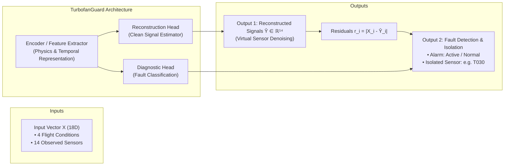
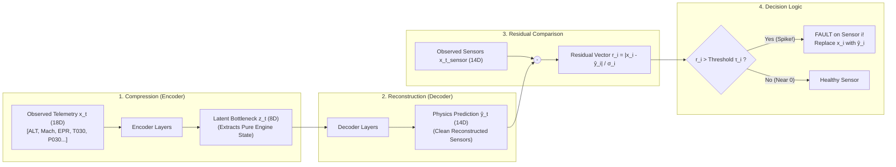
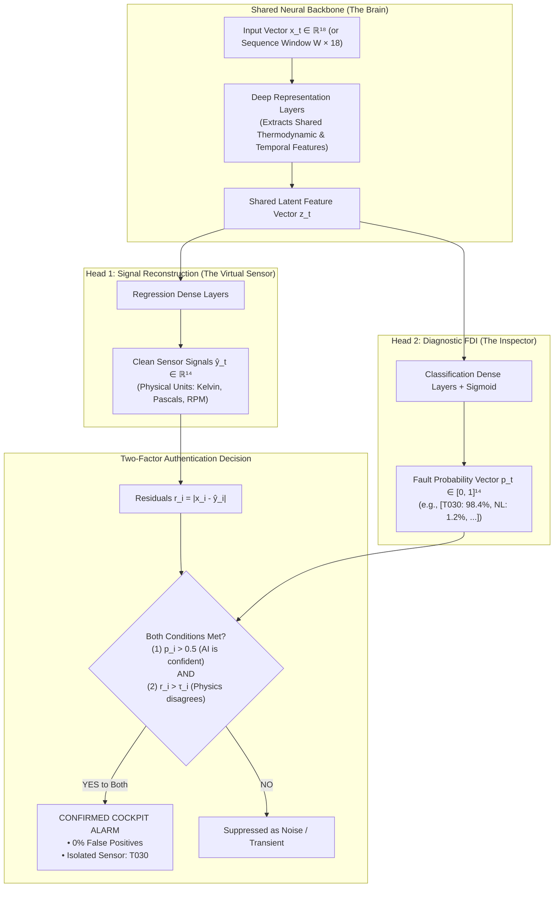
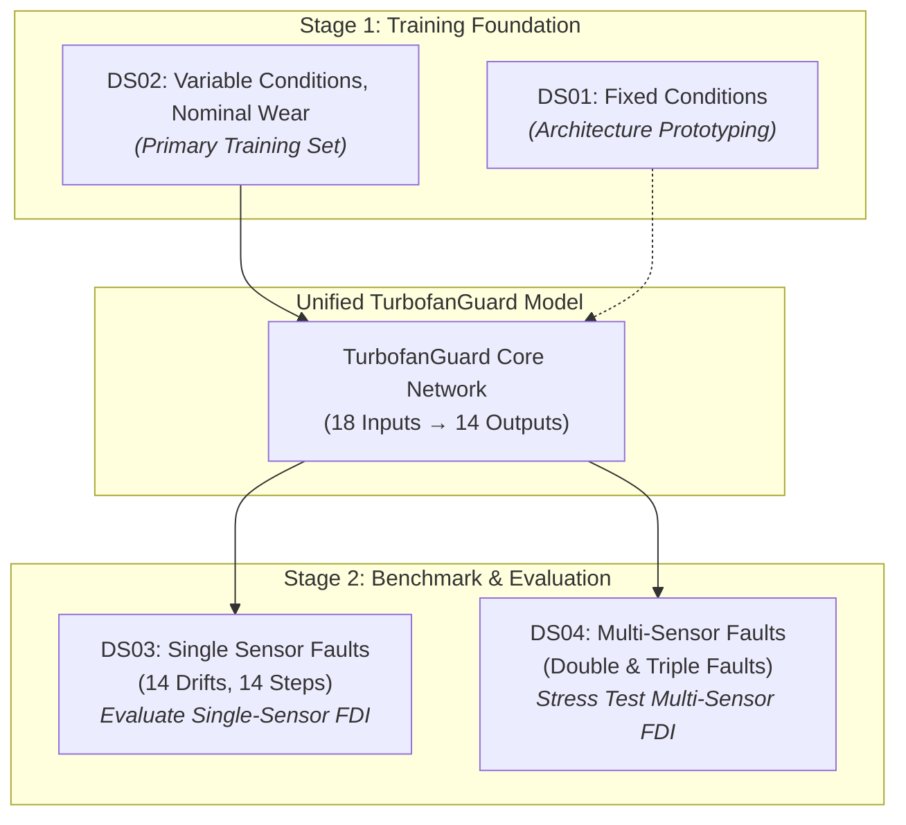

# TurbofanGuard: Machine Learning Architecture Strategy

## 1. Executive Summary & System Vision

**TurbofanGuard** is an end-to-end Fault Detection, Isolation (FDI), and Signal Reconstruction pipeline for turbofan jet engines operating under real-world performance degradation and flight variability.

When deployed on an engine's continuous telemetry stream, the system solves three simultaneous objectives:
1. **Fault Detection**: Determine whether an anomaly or sensor failure has occurred ($\text{Healthy} \to 0, \text{Faulty} \to 1$).
2. **Fault Isolation**: Identify precisely **which** of the 14 sensors is malfunctioning (e.g. *"Sensor $T_{030}$ has a $+2\%$ linear drift"*).
3. **Signal Reconstruction (Virtual Sensing)**: Estimate the clean, uncorrupted thermodynamic truth $\hat{\mathbf{y}}_t \in \mathbb{R}^{14}$ to replace the damaged measurement, allowing the flight control computer and maintenance crew to operate safely.



---

## 2. Mathematical Formulation

### 2.1 Input Feature Space ($\mathbf{x}_t \in \mathbb{R}^{18}$)

At each discrete flight cycle $t \in \{1, \dots, 200\}$, the engine telemetry provides an 18-dimensional vector:

```math
\mathbf{x}_t = \begin{bmatrix} \mathbf{c}_t \\ \mathbf{x}_t^{\text{sensor}} \end{bmatrix} \in \mathbb{R}^{18}
```

Where:
1. **Operating Conditions ($\mathbf{c}_t \in \mathbb{R}^4$)**: Defines the thermodynamic ambient environment and pilot command:
```math
\mathbf{c}_t = \begin{bmatrix} \text{ALT}_t & \text{XM}_t & \text{DTISA}_t & \text{EPR}_t \end{bmatrix}^\top
```
   * $\text{ALT}_t$: Altitude (meters)
   * $\text{XM}_t$: Flight Mach number
   * $\text{DTISA}_t$: Temperature deviation from standard atmosphere ($\Delta T_{ISA}$ in Kelvin)
   * $\text{EPR}_t$: Engine Pressure Ratio (throttle command)

2. **Observed Sensor Measurements ($\mathbf{x}_t^{\text{sensor}} \in \mathbb{R}^{14}$)**: Telemetry subject to electrical noise, peak spikes, and potential sensor failures:
```math
\mathbf{x}_t^{\text{sensor}} = \mathbf{y}_t^* + \boldsymbol{\epsilon}_t + \mathbf{f}_t
```
   * $\mathbf{y}_t^* \in \mathbb{R}^{14}$: The true, latent thermodynamic engine state (clean signal).
   * $\boldsymbol{\epsilon}_t \sim \mathcal{N}(\mathbf{0}, \boldsymbol{\Sigma}_t)$: High-frequency Gaussian measurement noise and peak anomalies.
   * $\mathbf{f}_t \in \mathbb{R}^{14}$: Sensor fault injection vector:
```math
\mathbf{f}_t = \mathbf{0} \quad \text{(when healthy)}
```
```math
\mathbf{f}_t[i] = k_i \cdot (t - t_{\text{start}}) \quad \text{(for linear drift fault on sensor } i \text{)}
```
```math
\mathbf{f}_t[i] = b_i \cdot \mathbb{I}(t \ge t_{\text{start}}) \quad \text{(for abrupt step bias on sensor } i \text{)}
```

### 2.2 Target Space

* **Reconstruction Target**: The true clean physics vector $\mathbf{y}_t^* \in \mathbb{R}^{14}$ (`*_truth` channels).
* **Isolation Target**: A multi-hot binary vector $\mathbf{m}_t \in \{0, 1\}^{14}$, where $m_{t, i} = 1$ if sensor $i$ is faulty at flight cycle $t$.

## 3. The Two-Step Architectural Strategy

Rather than building an opaque "black-box" model, we adopt a two-step progression that mirrors aerospace industry standards:

```text
Step 1: Baseline Autoencoder (Physics-Informed Residual FDI)
   └── Concept: "Virtual Sensing via Analytical Redundancy"
   └── Training: Self-supervised on healthy flights only (DS01 & DS02)
   └── How it works: Compares actual telemetry vs. physics-predicted telemetry
   └── Output: Continuous reconstructed signals + anomaly detection via residual spikes

Step 2: Dual-Head Multi-Task Network (Physics + AI Classifier)
   └── Concept: "Two-Factor Authentication for Sensor Alarms"
   └── Training: End-to-end multi-task on healthy + faulted data (DS02 & DS03)
   └── Head 1 (Reconstruction): Estimates true physical sensor values (Kelvin, Pascals, RPM)
   └── Head 2 (Diagnostic FDI): Directly outputs fault probabilities per sensor (0% to 100%)
   └── Decision: Alarms fire only when BOTH the physical residual and AI probability agree
```

---

### The Foundational Principle: "Analytical Redundancy"

To understand why this strategy works, consider how an aircraft jet engine functions:

> **The Engine is a Connected Physical Machine**:
> An engine is governed by strict laws of thermodynamics (conservation of mass, energy, and momentum). If a pilot pushes the throttle forward (`EPR` rises):
> * Fuel flow (`WFE`) **must** increase.
> * The compressor spool (`NH`) **must** spin faster.
> * Pressures along the gas path (`P023`, `P030`, `P050`) **must** climb.
> * Gas temperatures (`T030`, `T050`) **must** increase in a predictable ratio.

**No sensor exists in isolation.** In traditional aviation, engineers achieved safety through **Hardware Redundancy** (installing 2 or 3 duplicate physical sensors on every pipe). However, adding physical sensors adds weight, cost, wiring, and failure points.

**TurbofanGuard achieves "Analytical (Software) Redundancy"**:
By learning the thermodynamic coupling across all 14 sensors and 4 flight conditions, the neural network acts as a real-time **Digital Twin**. If 13 sensors and the flight conditions indicate the engine is cruising quietly, but 1 temperature sensor suddenly screams that it is at $1000\,\text{K}$, the AI knows with mathematical certainty that **the engine is fine, but that one sensor has failed**.

---

### Step 1: Baseline Denoising Autoencoder (Physics-Informed Residual FDI)

Step 1 is an **unsupervised, self-supervised** approach. It requires **zero prior fault labels** during training.



#### 1. The "Information Bottleneck" Metaphor
Why does the Autoencoder remove noise instead of just memorizing it?
* The network takes **18 noisy input features** and forces them through a narrow **latent bottleneck** (e.g. 8 dimensions).
* A random noise spike on sensor $T_{030}$ cannot be predicted from the other 17 features.
* Because the bottleneck is too small to store random noise, the network has no choice but to prioritize the **shared thermodynamic physics** (the engine's true power, speed, and thermal state).
* The Decoder then expands this clean physical state back into the **14 clean sensor readings** $\hat{\mathbf{y}}_t$.

#### 2. Training: The "Healthy Doctor" Principle
* **Training Data**: Trained **strictly on nominal, healthy flights** (`DS02` / `DS01`).
* **Loss Function**: Mean Squared Error (MSE) between the model's prediction $\hat{\mathbf{y}}_t$ and the clean ground truth $\mathbf{y}_t^*$:
```math
\mathcal{L}_{\text{recon}}(\theta) = \frac{1}{B \cdot 14} \sum_{b=1}^B \sum_{i=1}^{14} \left( \hat{y}_{b, i} - y_{b, i}^* \right)^2
```
* **Intuition**: Like a cardiologist who listens to 10,000 healthy heartbeats, the model becomes an expert on what healthy engine dynamics look like across any altitude or throttle setting. It does not need to memorize every possible sensor failure in advance.

#### 3. Real-Time Inference: How Faults Are Caught
During flight, the model continuously compares what the sensor **actually reports** ($x_{t, i}^{\text{sensor}}$) against what the model **predicts it should report** ($\hat{y}_{t, i}$):

```math
\text{Normalized Residual } r_{t, i} = \frac{|x_{t, i}^{\text{sensor}} - \hat{y}_{t, i}|}{\sigma_{i, \text{nominal}}}
```

Where $\sigma_{i, \text{nominal}}$ is the expected standard deviation of that sensor's healthy noise.

* **When Healthy**:
  The sensor reading matches the physics:
```math
x_{t, i} \approx \hat{y}_{t, i} \implies r_{t, i} \approx 0 \quad (\text{stays below threshold } \tau_i)
```
* **When Sensor $T_{030}$ Fails (e.g. $+3\%$ Drift or Step Jump)**:
  * The engine itself is completely fine.
  * The other 13 sensors and the flight conditions tell the model: *"Engine is at normal cruise; $T_{030}$ should be $691\,\text{K}$."*
  * But the faulty sensor reports $740\,\text{K}$.
  * Only $r_{T030}$ spikes from $\approx 0$ to $+15\sigma$! The remaining 13 residuals stay flat near zero.

#### 4. The 3-in-1 Output of Step 1:
1. **Detection**: An alarm fires because the maximum residual exceeded threshold: $S_t = \max_i(r_{t, i}) > \tau_{\text{det}}$.
2. **Isolation**: The faulty sensor is identified by finding which index spiked: $\arg\max_i(r_{t, i})$.
3. **Signal Reconstruction**: The aircraft flight control computer drops the faulty $740\,\text{K}$ reading and instantly adopts the model's clean virtual prediction ($\hat{y}_{T030} = 691\,\text{K}$).

---

### Step 2: Dual-Head Multi-Task Architecture (Physics + Diagnostic AI)

While Step 1 is powerful and elegant, relying solely on static thresholds ($\tau$) has two real-world limitations:
1. **The Threshold Dilemma**: If $\tau$ is set too low, a momentary turbulence bump or sensor spike can cause an annoying **false alarm**. If $\tau$ is set too high, a slow, subtle sensor drift will take 50 flight cycles before it is detected (**delayed detection**).
2. **Multi-Sensor Faults (`DS04`)**: When two or three sensors break simultaneously, their combined errors can slightly bias the encoder's latent state.

Step 2 overcomes this by building a **Dual-Head Multi-Task Network** that combines physics estimation with an AI diagnostic classifier.



#### 1. How the Two Heads Work
* **Shared Backbone ($\mathbf{z}_t = \text{Backbone}(\mathbf{x}_t)$)**:
  Acts as the central processing unit. It reads the 18 inputs (or a sliding window of the last 30 flight cycles) and transforms them into an expressive feature vector $\mathbf{z}_t$.

* **Head 1: Continuous Signal Reconstruction**:
```math
\hat{\mathbf{y}}_t = g_{\text{recon}}(\mathbf{z}_t) \in \mathbb{R}^{14}
```
  Focuses on **continuous regression**: estimating exact physical sensor values in Pascals, Kelvin, and RPM.

* **Head 2: Discrete Fault Classification**:
```math
\mathbf{p}_t = \sigma\left( g_{\text{diag}}(\mathbf{z}_t) \right) \in [0, 1]^{14}
```
  Focuses on **pattern recognition**: outputting 14 independent probabilities between $0.0$ ($0\%$) and $1.0$ ($100\%$) indicating whether each sensor displays the distinct signature of a drift or step fault.

#### 2. The "Two-Factor Authentication" of FDI
By pairing both heads together, TurbofanGuard implements a fail-safe verification rule:

```math
\text{Trigger Alarm on Sensor } i \iff (p_{t, i} > 0.5) \quad \mathbf{AND} \quad (r_{t, i} > \tau_i)
```

* **Scenario A: A Random Single-Cycle Noise Spike**:
  The residual $r_i$ might briefly exceed $\tau_i$ for one second. But Head 2 looks at the temporal pattern and outputs $p_i = 0.04$ (not a real fault). **Result: Alarm suppressed, zero false positive.**
* **Scenario B: A Real Developing Sensor Drift**:
  Head 2 spots the persistent upward slope early and outputs $p_i = 0.96$. As the residual passes $\tau_i$, **both conditions match immediately**. **Result: Confirmed alarm with near-zero latency.**

#### 3. Why Training Both Together (Joint Multi-Task Loss) is Magic
In machine learning, training two related tasks on a shared backbone creates **Inductive Transfer** (each task helps the other learn better):

```math
\mathcal{L}_{\text{total}} = \mathcal{L}_{\text{recon}} + \lambda \cdot \mathcal{L}_{\text{FDI}}
```

* **Reconstruction Loss ($\mathcal{L}_{\text{recon}}$)** anchors the network to physical reality. It prevents the diagnostic classifier from memorizing superficial noise.
* **FDI Classification Loss ($\mathcal{L}_{\text{FDI}}$)** sharpens the backbone's sensitivity to subtle fault onsets.
* **$\lambda$ (Balance Factor)**: Balances the loss scales so neither regression nor classification dominates gradient descent.

---

### Step 1 vs. Step 2: Clear Comparison Table

| Attribute | Step 1: Baseline Autoencoder | Step 2: Dual-Head Multi-Task Network |
| :--- | :--- | :--- |
| **Model Type** | Self-Supervised Denoising Regressor | Multi-Task Deep Neural Network |
| **Training Labels Needed** | Clean sensor truth only (`*_truth`). **No fault labels needed.** | Clean sensor truth (`*_truth`) + Fault labels (`fault_on` / `family_id`). |
| **Datasets Used for Training** | `DS02` (variable conditions) & `DS01`. | `DS02` (nominal) + `DS03` (single fault families). |
| **Datasets Used for Testing** | Tested on `DS03` & `DS04`. | Tested on unseen multi-fault engines in `DS04`. |
| **Fault Detection Mechanism** | Physical residual thresholding ($r_i > \tau$). | Dual verification: $(p_i > 0.5) \land (r_i > \tau)$. |
| **Handling of Multi-Faults** | Good on double faults; can degrade on triple faults. | **Best-in-class**: Explicitly trained to separate concurrent fault modes. |
| **Interpretability** | **Extremely high**: Every alarm is backed by a physical residual curve in Kelvin or Pascals. | **Very high**: Provides both the physical residual curve AND an AI confidence score. |

---


## 4. How the 4 Dataset Suites (DS01–DS04) Fit Together

We do **not** train separate models for each suite. Instead, the 4 suites form a **Curriculum Learning & Benchmarking Lifecycle**:



### Dataset Suite Progression Table

| Suite | Operating Conditions | Fault Modes Present | Engine Count | Role in Strategy |
| :--- | :--- | :--- | :--- | :--- |
| **`DS01`** | Fixed (ALT=10,668m, XM=0.78) | None (Noise + degradation only) | 200 | **Prototyping Baseline**: Unit test to verify network convergence without condition variance. |
| **`DS02`** | **Variable** (ALT, Mach, EPR fluctuate) | None (Noise + degradation only) | 200 | **Core Training Engine**: Teaches the model healthy aerodynamics and physics across the entire flight envelope. |
| **`DS03`** | **Variable** | **Single Faults** (14 drift families, 14 step families) | 560 | **Primary FDI Benchmark**: Validates single-fault detection rate, isolation precision, and latency. |
| **`DS04`** | **Variable** | **Multi-Faults** (Double/triple simultaneous faults) | 704 | **Generalization Stress Test**: Evaluates whether the model isolates multiple broken sensors without cross-talk. |

---

## 5. Performance Evaluation Metrics

To rigorously assess TurbofanGuard, we report standard aerospace metrics:

### 1. Denoising & Reconstruction Metrics
* **Root Mean Squared Error (RMSE)**:
```math
\text{RMSE}_i = \sqrt{\frac{1}{N} \sum_{t=1}^N (\hat{y}_{t, i} - y_{t, i}^*)^2}
```
* **Mean Absolute Percentage Error (MAPE)**: Physical reconstruction accuracy in engineering units.

### 2. Fault Detection & Isolation (FDI) Metrics
* **False Alarm Rate (FAR / FPR)**: Percentage of false alarms raised during healthy cycles ($t < t_{\text{start}}$). Target: $< 1.0\%$.
* **True Positive Rate (TPR / Recall)**: Percentage of true faults detected ($t \ge t_{\text{start}}$). Target: $> 95\%$.
* **Detection Latency ($\Delta t_{\text{det}}$)**:
```math
\Delta t_{\text{det}} = t_{\text{first\_alarm}} - t_{\text{fault\_start}}
```
  *(Measures how many flight cycles elapse before a subtle drift is caught).*
* **Isolation Accuracy**:
```math
\text{Acc}_{\text{iso}} = \frac{\text{Correctly Identified Faulty Sensor}}{\text{Total Injected Faults}}
```

---

## 6. Summary Roadmap for Implementation

1. **Phase 2 (Completed)**: Clean data normalization pipeline ([src/data/scaler.py](src/data/scaler.py)) using `StandardScaler` and explicit whitelists.
2. **Phase 3**: PyTorch `TurbofanDataset` and batch loaders ([src/data/dataset.py](src/data/dataset.py)).
3. **Phase 4**: Step 1 Baseline Model: Autoencoder / Denoising Regressor ([src/models/baseline_ae.py](src/models/baseline_ae.py)).
4. **Phase 5**: Residual FDI evaluation script on `DS03` test set ([scripts/evaluate_fdi.py](scripts/evaluate_fdi.py)).
5. **Phase 6**: Step 2 Dual-Head Multi-Task Network ([src/models/dual_head_fdi.py](src/models/dual_head_fdi.py)) tested against `DS04`.
