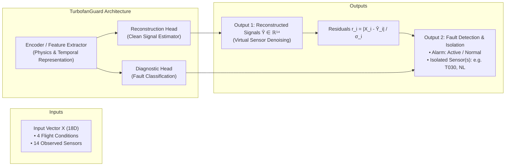
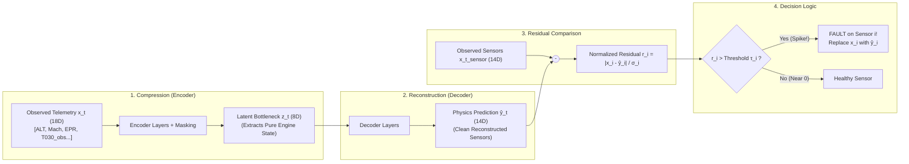
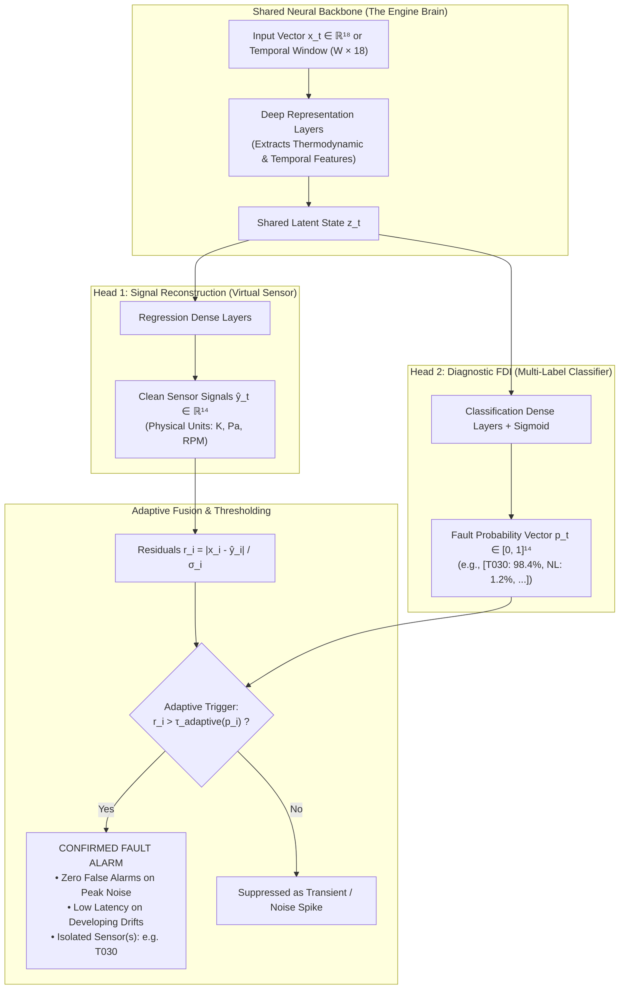
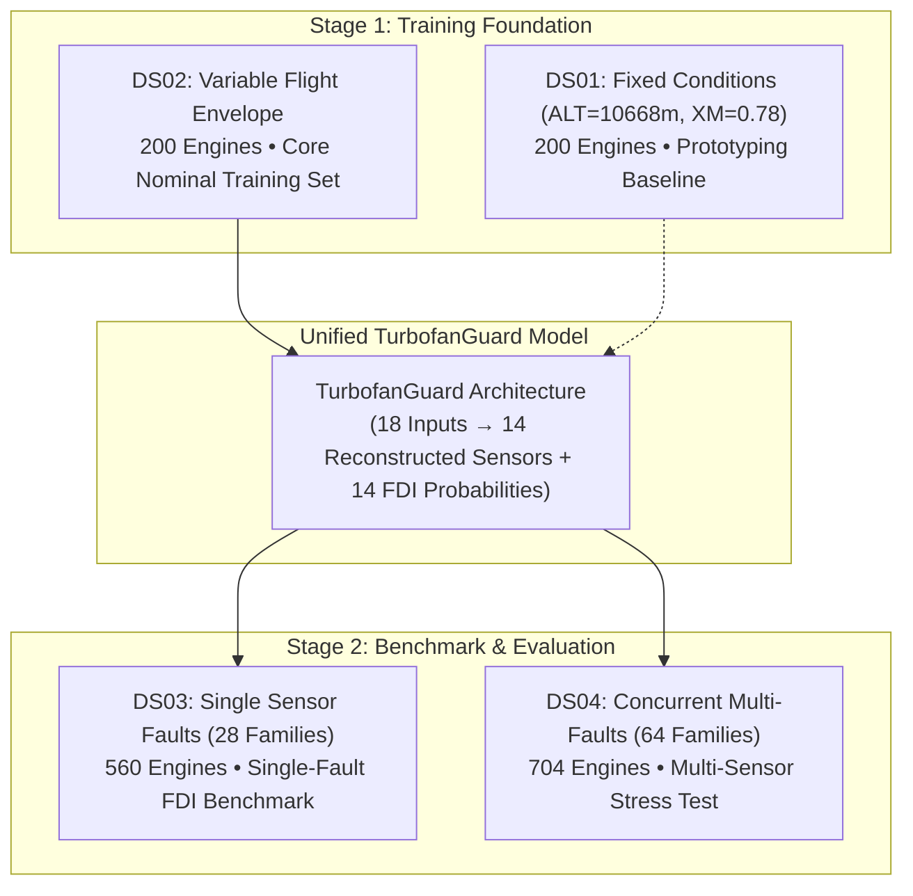

# TurbofanGuard: Machine Learning Architecture Strategy

## 1. Executive Summary & System Vision

**TurbofanGuard** is an end-to-end Fault Detection, Isolation (FDI), and Signal Reconstruction pipeline for turbofan jet engines operating under real-world performance degradation and flight variability.

When deployed on an engine's continuous telemetry stream, the system solves three simultaneous objectives:

1. **Fault Detection**: Determine whether an anomaly or sensor failure has occurred:
```math
\text{State}_t \in \{0, 1\} \quad (0 = \text{Healthy}, \; 1 = \text{Faulty})
```
* **In Plain English**: At every discrete flight cycle, the system makes a binary decision: is the overall engine telemetry healthy ($0$), or has at least one sensor failed ($1$)?
* **Variables**:
  * $\text{State}_t$: Binary health status of the engine sensing system at flight cycle $t$.
  * $0$: Normal / healthy state (all sensors operating normally).
  * $1$: Fault state (one or more sensors are malfunctioning).

2. **Fault Isolation**: Identify precisely **which** of the 14 sensors is malfunctioning (e.g. sensor $T_{030}$ with linear drift or concurrent multi-sensor failures).

3. **Signal Reconstruction (Virtual Sensing)**: Estimate the clean, uncorrupted thermodynamic truth to replace damaged measurements:
```math
\hat{\mathbf{y}}_t \in \mathbb{R}^{14}
```
* **In Plain English**: The virtual sensor outputs a list of 14 numbers representing what all 14 engine sensors *should* read under true physics, with all noise and fault biases removed.
* **Variables**:
  * $\hat{\mathbf{y}}_t$ ("y-hat"): The 14-dimensional vector of clean, reconstructed sensor estimates at flight cycle $t$.
  * $\mathbb{R}^{14}$: 14-dimensional real coordinate space (one continuous physical value per sensor channel).



---

## 2. Mathematical Formulation

### 2.1 Input Feature Space

At each discrete flight cycle $t \in \{1, \dots, 200\}$, the engine telemetry provides an 18-dimensional input vector:

```math
\mathbf{x}_t = \begin{bmatrix} \mathbf{c}_t \\ \mathbf{x}_t^{\text{sensor}} \end{bmatrix} \in \mathbb{R}^{18}
```
* **In Plain English**: The input fed into the neural network at each cycle is a single 18-element column vector created by stacking the 4 environmental flight conditions on top of the 14 raw sensor measurements.
* **Variables**:
  * $\mathbf{x}_t$: Complete 18-dimensional telemetry input vector at flight cycle $t$.
  * $\mathbf{c}_t$: 4-dimensional vector of flight operating conditions at cycle $t$.
  * $\mathbf{x}_t^{\text{sensor}}$: 14-dimensional vector of observed sensor telemetry at cycle $t$.
  * $\mathbb{R}^{18}$: 18-dimensional real vector space (4 conditions + 14 sensors = 18 inputs).

Where:

#### 1. Operating Conditions
Defines the thermodynamic ambient environment and pilot command:

```math
\mathbf{c}_t = \begin{bmatrix} \text{ALT}_t \\ \text{XM}_t \\ \text{DTISA}_t \\ \text{EPR}_t \end{bmatrix} \in \mathbb{R}^4
```
* **In Plain English**: These 4 numbers inform the model where the aircraft is flying, how fast it is moving, how warm or cold the ambient air is, and how much thrust the pilot has demanded.
* **Variables**:
  * $\mathbf{c}_t$: Operating condition vector at flight cycle $t$.
  * $\text{ALT}_t$: Flight altitude in meters (baseline cruise is 10,668 m, or 35,000 ft).
  * $\text{XM}_t$: Flight Mach number, which is speed relative to the speed of sound (dimensionless, baseline cruise is 0.78).
  * $\text{DTISA}_t$: Delta $T_{\text{ISA}}$, the ambient temperature deviation from standard international atmosphere in Kelvin.
  * $\text{EPR}_t$: Engine Pressure Ratio, the ratio of turbine outlet total pressure to fan inlet total pressure; serves as the primary throttle command (dimensionless, baseline cruise is 1.8118).

#### 2. Observed Sensor Measurements
Telemetry subject to random measurement noise, peak spikes, and potential sensor fault injections:

```math
\mathbf{x}_t^{\text{sensor}} = \mathbf{y}_t^* + \boldsymbol{\epsilon}_t + \mathbf{f}_t \in \mathbb{R}^{14}
```
* **In Plain English**: What a physical sensor actually records in telemetry equals the true underlying engine physics, plus random electrical/environmental noise, plus any error caused by an active sensor breakdown.
* **Variables**:
  * $\mathbf{x}_t^{\text{sensor}}$: 14 observed sensor channels recorded in telemetry at cycle $t$.
  * $\mathbf{y}_t^*$: True, latent thermodynamic engine state (the clean signal if no noise or faults existed).
  * $\boldsymbol{\epsilon}_t$: Total measurement noise vector added by electronics and sensor instrumentation.
  * $\mathbf{f}_t$: Fault injection vector representing physical or electrical failure on one or more sensors (equals zero when healthy).

The true, uncorrupted thermodynamic engine state (clean target signal):

```math
\mathbf{y}_t^* \in \mathbb{R}^{14}
```
* **In Plain English**: The ideal, noise-free physical truth across all 14 engine stations (temperatures in Kelvin, pressures in Pascals/bar, rotational speeds in RPM, fuel flow in kg/s).
* **Variables**:
  * $\mathbf{y}_t^*$: 14 clean ground-truth values (`NH_truth`, `NL_truth`, `WFE_truth`, `PS0_truth`, `P2_truth`, `P023_truth`, `P030_truth`, `P044_truth`, `P050_truth`, `P134_truth`, `T2_truth`, `T023_truth`, `T030_truth`, `T050_truth`).

#### Telemetry Noise Model
Telemetry is corrupted by a composite noise process:

```math
\boldsymbol{\epsilon}_t = \boldsymbol{\eta}_t + \mathbf{p}_t
```
* **In Plain English**: Total sensor noise is composed of two independent phenomena: constant background Gaussian noise present on every reading, plus occasional high-magnitude spikes.
* **Variables**:
  * $\boldsymbol{\epsilon}_t$: Composite noise vector affecting all 14 sensors at cycle $t$.
  * $\boldsymbol{\eta}_t$: High-frequency Gaussian measurement noise.
  * $\mathbf{p}_t$: Sparse peak noise vector (intermittent large electrical spikes occurring on ~1% of samples).

Where zero-mean Gaussian measurement noise is defined as:

```math
\boldsymbol{\eta}_t \sim \mathcal{N}(\mathbf{0}, \boldsymbol{\Sigma}_t)
```
* **In Plain English**: Background measurement noise follows a bell curve centered at zero error, with individual standard deviations for each sensor that fluctuate randomly between 1.0x and 3.0x across different flights.
* **Variables**:
  * $\boldsymbol{\eta}_t$: Gaussian noise vector at cycle $t$.
  * $\sim$: Drawn from / distributed according to.
  * $\mathcal{N}$: Normal (Gaussian) probability distribution.
  * $\mathbf{0}$: Mean vector of 14 zeros (noise does not create a permanent bias).
  * $\boldsymbol{\Sigma}_t$: Covariance matrix containing the individual variance (standard deviation squared) for each of the 14 sensor channels.

#### Sensor Fault Injection Vector
For healthy flight cycles before fault onset:

```math
\mathbf{f}_t = \mathbf{0} \quad (t < t_{\text{start}})
```
* **In Plain English**: Before a fault starts, the fault injection vector has a value of zero on all 14 channels—the engine sensors are undamaged.
* **Variables**:
  * $\mathbf{f}_t$: 14-dimensional sensor fault vector at cycle $t$.
  * $\mathbf{0}$: Vector of 14 zeros.
  * $t$: Current flight cycle counter ($t \in \{1, \dots, 200\}$).
  * $t_{\text{start}}$: Flight cycle at which a sensor fault begins.

For a sensor $i$ experiencing a fault starting at flight cycle $t_{\text{start}}$:

* **Linear Drift**:
```math
\mathbf{f}_t[i] = k_i \cdot (t - t_{\text{start}}) \quad (t \ge t_{\text{start}})
```
* **In Plain English**: Sensor $i$ gradually drifts away from true physics at a steady rate of $k_i$ engineering units per flight cycle.
* **Variables**:
  * $\mathbf{f}_t[i]$: Fault error added to sensor $i$ at cycle $t$.
  * $i$: Index of the malfunctioning sensor ($i \in \{1, \dots, 14\}$).
  * $k_i$: Drift slope (rate of error added per flight cycle; can be positive or negative).
  * $t - t_{\text{start}}$: Number of flight cycles elapsed since the fault began.

* **Exponential / Non-Linear Drift**:
```math
\mathbf{f}_t[i] = \text{sign}_i \cdot \alpha_i \cdot (t - t_{\text{start}})^{\beta_i} \quad (t \ge t_{\text{start}}, \; \beta_i \in [2.0, 5.0])
```
* **In Plain English**: Sensor $i$ drifts away slowly at first, but accelerates non-linearly over time according to a power-law exponent between 2.0 and 5.0.
* **Variables**:
  * $\mathbf{f}_t[i]$: Fault error added to sensor $i$ at cycle $t$.
  * $\text{sign}_i$: Direction of the drift (+1 for positive upward drift, -1 for negative downward drift).
  * $\alpha_i$: Drift intensity scaling coefficient.
  * $\beta_i$: Non-linear growth exponent ($\beta_i \in [2.0, 5.0]$).
  * $t - t_{\text{start}}$: Elapsed flight cycles since fault initiation.

* **Abrupt Step / Bias**:
```math
\mathbf{f}_t[i] = b_i \cdot \mathbb{I}(t \ge t_{\text{start}})
```
* **In Plain English**: At cycle $t_{\text{start}}$, sensor $i$ instantaneously jumps by a fixed constant bias $b_i$ and stays offset permanently.
* **Variables**:
  * $\mathbf{f}_t[i]$: Fault error added to sensor $i$ at cycle $t$.
  * $b_i$: Fixed bias magnitude (e.g. +15 Kelvin or -20 kPa).
  * $\mathbb{I}(\cdot)$: Mathematical indicator function, which equals 1 when the condition $t \ge t_{\text{start}}$ is true, and 0 otherwise.

* **Rapid-Growth Step**:
```math
\mathbf{f}_t[i] = b_i \cdot \min\left(1, \; \frac{t - t_{\text{start}}}{\Delta t_{\text{growth}}}\right) \quad (\Delta t_{\text{growth}} \in [2, 6])
```
* **In Plain English**: The fault ramps up linearly from zero to full bias $b_i$ over a brief window of 2 to 6 flights, and then remains permanently clamped at $b_i$.
* **Variables**:
  * $\mathbf{f}_t[i]$: Fault error added to sensor $i$ at cycle $t$.
  * $b_i$: Final asymptotic bias magnitude.
  * $\Delta t_{\text{growth}}$: Ramp-up duration in flight cycles (takes between 2 and 6 cycles to reach full error).
  * $\min(1, \cdot)$: Clamps the multiplier at 1.0 once the ramp period completes so the bias stops growing.

> [!IMPORTANT]
> **Strict Isolation of Latent Health Indices (Zero Target Leakage)**:
> The dataset records 10 internal degradation health states (`DETA024`, `CW024`, `DETA120`, `CW120`, `DETA026`, `CW026`, `DETA040`, `CW040`, `DETA044`, `CW044`). In real operational jet engines, component efficiency degradation and flow capacity change cannot be directly instrumented during flight. They are strictly isolated and excluded from model inputs $\mathbf{x}_t$ to prevent data leakage.

---

### 2.2 Target Space & Data Schema

* **Reconstruction Target**: The clean physics vector (`*_truth` channels):
```math
\mathbf{y}_t^* \in \mathbb{R}^{14}
```
* **In Plain English**: The true clean thermodynamic values across all 14 gas-path sensors without measurement noise or fault offsets.

* **Isolation Target**: A multi-hot binary indicator vector:
```math
\mathbf{m}_t \in \{0, 1\}^{14}
```
* **In Plain English**: A binary checklist of 14 flags indicating which sensors are broken at flight cycle $t$.
* **Variables**:
  * $\mathbf{m}_t$: Multi-hot binary fault indicator vector for the 14 sensors at cycle $t$.
  * $\{0, 1\}^{14}$: 14 independent binary decisions, each strictly 0 (healthy) or 1 (faulty).

where each element indicates whether sensor $i$ is actively faulty at flight cycle $t$:
```math
m_{t, i} = 1 \iff \text{Sensor } i \text{ is faulty at cycle } t
```
* **In Plain English**: Element $i$ equals 1 if and only if sensor $i$ has an active fault at cycle $t$; otherwise it equals 0.
* **Variables**:
  * $m_{t, i}$: Binary fault indicator for sensor $i$ at flight cycle $t$.
  * $\iff$: If and only if.

#### Suite Schema Mapping
The ground-truth isolation vector is dynamically constructed across suites:

* **DS01 & DS02**: All cycles are nominal:
```math
\mathbf{m}_t = \mathbf{0} \in \{0\}^{14} \quad (\forall t)
```
* **In Plain English**: In suites DS01 and DS02, all engines operate nominally without sensor faults, so the target vector is entirely zeros at every cycle.

* **DS03 (Single Faults)**: Parquet provides scalar `fault_on` $\in \{0, 1\}$. When active (`fault_on == 1`), the affected sensor channel is flagged:
```math
m_{t, i} = 1 \quad \text{for } i = \text{affected\_sensor}
```
* **In Plain English**: In suite DS03, exactly one sensor breaks per engine; only that specific channel turns to 1 after its fault start cycle.

* **DS04 (Multi-Faults)**: Parquet provides separate activation flags `fault_a_on`, `fault_b_on`, and `fault_c_on`. When active, corresponding sensor channels from `fault_a_measurement`, `fault_b_measurement`, and `fault_c_measurement` (from `engine_manifest.csv`) are flagged:
```math
m_{t, i} = 1 \quad \text{for each active fault channel}
```
* **In Plain English**: In suite DS04, multiple sensors break simultaneously; each active fault channel sets its corresponding sensor index to 1.

---

## 3. The Two-Step Architectural Strategy

Rather than deploying an opaque black-box classifier, TurbofanGuard follows a structured two-step roadmap:

```text
Step 1: Baseline Denoising Autoencoder / Virtual Sensor (Physics Residual FDI)
   └── Concept: "Virtual Sensing via Analytical Redundancy"
   └── Training: Supervised denoising on nominal flights only (DS01 & DS02)
   └── Supervision: Clean targets y* (zero fault labels required during training)
   └── Output: Denoised virtual signals ŷ + anomaly detection via physical residual spikes

Step 2: Dual-Head Multi-Task Network (Physics + Diagnostic AI)
   └── Concept: "Two-Factor Authentication for Sensor Alarms"
   └── Training: End-to-end multi-task on nominal + faulted data (DS02, DS03, DS04)
   └── Head 1 (Reconstruction): Estimates continuous physical sensor values (K, Pa, RPM)
   └── Head 2 (Diagnostic FDI): Outputs multi-label fault probabilities per sensor (0% to 100%)
   └── Decision: Dynamic thresholding fusing physical residuals with AI confidence
```

---

### The Foundational Principle: "Analytical Redundancy"

To understand why this strategy works, consider how an aircraft jet engine functions:

> **The Engine is a Coupled Thermodynamic Machine**:
> Gas turbine operation is governed by strict laws of thermodynamics (conservation of mass, energy, and momentum). When a pilot advances the throttle command (`EPR` rises):
> * Fuel flow (`WFE`) **must** increase.
> * High-pressure spool speed (`NH`) and low-pressure spool speed (`NL`) **must** accelerate.
> * Pressures along the gas path (`P023`, `P030`, `P044`, `P050`) **must** climb in deterministic ratios.
> * Gas temperatures (`T023`, `T030`, `T050`) **must** follow predictable thermodynamic gradients.

**No sensor exists in isolation.** In traditional aviation, reliability was achieved through **Hardware Redundancy** (installing 2 or 3 duplicate physical sensors on each station). However, duplicate hardware adds structural weight, cabling, maintenance burden, and additional points of failure.

**TurbofanGuard achieves "Analytical (Software) Redundancy"**:
By learning the thermodynamic coupling across all 14 sensors and 4 flight conditions, the neural network acts as an on-wing **Digital Twin**. If 13 sensors and the flight conditions indicate standard cruise conditions, but sensor $T_{030}$ reports $740\,\text{K}$ instead of the physical $691\,\text{K}$, the analytical residual exposes that **the engine thermodynamic cycle is normal, but sensor $T_{030}$ is faulty**.

---

### Step 1: Baseline Denoising Autoencoder (Physics-Informed Residual FDI)

Step 1 employs **supervised denoising regression on nominal flights**. Because it is trained exclusively on healthy data (`DS01` and `DS02`), it requires **zero fault labels** to train, functioning as an unsupervised anomaly detector during deployment.



#### 1. The Information Bottleneck & Robust Encoding
* The network compresses **18 input features** through a narrow **latent bottleneck** (e.g. 8 dimensions).
* **Physical Justification**: For a twin-spool turbofan operating at stabilized cruise, the thermodynamic cycle is governed by approximately 4 to 6 primary degrees of freedom (ambient altitude, Mach, ambient temperature, throttle setting, and component degradation states).
* **Latent Robustness via Channel Masking**: To prevent large sensor faults (e.g. a $10\sigma$ step jump) from corrupting the latent bottleneck $\mathbf{z}_t$ and smearing residual errors across healthy sensors during inference, the encoder is trained with **random channel masking / denoising augmentation** (randomly zeroing or perturbing 1–2 sensor channels during training). This forces the bottleneck to derive state estimates from operating conditions and remaining uncorrupted sensors.

#### 2. Training Objective: Supervised Denoising on Nominal Flights
* **Training Data**: Trained strictly on healthy flight cycles from `DS02` (variable conditions) and `DS01` (fixed baseline).
* **Loss Function**: Mean Squared Error between model estimates and true thermodynamic values:
```math
\mathcal{L}_{\text{recon}}(\theta) = \frac{1}{B \cdot 14} \sum_{b=1}^B \sum_{i=1}^{14} \left( \hat{y}_{b, i} - y_{b, i}^* \right)^2
```
* **In Plain English**: During training on healthy flights, we calculate the average squared difference between the virtual sensor predictions and the true physical values across all 14 sensors. The optimizer updates neural network weights $\theta$ to minimize this error.
* **Variables**:
  * $\mathcal{L}_{\text{recon}}(\theta)$: Mean squared error reconstruction loss.
  * $\theta$: All trainable weights and biases in the encoder and decoder.
  * $B$: Batch size (number of engine snapshot samples processed in one gradient step).
  * $14$: Number of sensor channels.
  * $\hat{y}_{b, i}$: Predicted clean sensor value for sensor $i$ on batch sample $b$.
  * $y_{b, i}^*$: True clean ground-truth sensor value for sensor $i$ on batch sample $b$.

#### 3. Real-Time Inference: Normalized Residuals
During flight, the model continuously calculates the discrepancy between reported telemetry and virtual sensor predictions:

```math
r_{t, i} = \frac{|x_{t, i}^{\text{sensor}} - \hat{y}_{t, i}|}{\sigma_{i, \text{nominal}}}
```
* **In Plain English**: The residual measures how many standard deviations of normal noise the actual sensor reading is away from what the physics model predicts it should be.
* **Variables**:
  * $r_{t, i}$: Normalized residual for sensor $i$ at flight cycle $t$ (dimensionless score).
  * $x_{t, i}^{\text{sensor}}$: Raw telemetry reading reported by physical sensor $i$.
  * $\hat{y}_{t, i}$: Virtual sensor prediction (physics estimate) for sensor $i$.
  * $|\cdot|$: Absolute error magnitude (positive distance).
  * $\sigma_{i, \text{nominal}}$: Expected standard deviation of nominal healthy noise for sensor $i$.

* **Healthy Nominal Operation**: The residual remains below threshold:
```math
x_{t, i} \approx \hat{y}_{t, i} \implies r_{t, i} < \tau_i \quad (\text{typically } \tau_i \in [3.5, 4.5]\sigma)
```
* **In Plain English**: When the sensor is healthy, its measurement closely matches the physics prediction, keeping the residual well below the alarm threshold (typically 3.5 to 4.5 standard deviations).
* **Variables**:
  * $\approx$: Approximately equal to.
  * $\implies$: Mathematical implication ("leads to").
  * $\tau_i$: Static residual threshold for sensor $i$.

* **Sensor Failure (e.g. +3% Drift or Step Jump on $T_{030}$)**:  
Operating conditions and the remaining 13 sensors confirm standard cruise (predicted $691\,\text{K}$), but the sensor reports a faulty value ($740\,\text{K}$). Only $r_{T_{030}}$ spikes (e.g. to $+15\sigma$), while other residuals remain flat below threshold.

#### 4. The 3-in-1 Output of Step 1:
1. **Detection**: An alarm triggers if the maximum residual exceeds threshold:
```math
\max_i(r_{t, i}) > \tau_{\text{det}}
```
* **In Plain English**: A fault detection alarm sounds if the worst residual among all 14 sensors exceeds the global threshold.
* **Variables**:
  * $\max_i(r_{t, i})$: Highest residual among all 14 sensors at cycle $t$.
  * $\tau_{\text{det}}$: Master detection threshold.

2. **Isolation**: Faulty sensor is isolated:
```math
\hat{i}_{\text{fault}} = \arg\max_i(r_{t, i})
```
* **In Plain English**: The isolated faulty sensor is chosen as the specific sensor index whose residual had the highest spike.
* **Variables**:
  * $\hat{i}_{\text{fault}}$: Predicted index of the failing sensor.
  * $\arg\max_i$: Returns the channel index $i$ that maximizes the residual.

3. **Signal Reconstruction**: Flight systems substitute the corrupted reading with virtual prediction:
```math
\hat{x}_{t, i} \leftarrow \hat{y}_{t, i}
```
* **In Plain English**: Once a sensor is confirmed faulty, the flight computer drops the bad physical measurement and adopts the model's clean virtual prediction.
* **Variables**:
  * $\hat{x}_{t, i}$: Validated telemetry signal forwarded to flight control computers.
  * $\leftarrow$: Replacement operator.
  * $\hat{y}_{t, i}$: Model-estimated clean sensor value.

---

### Step 2: Dual-Head Multi-Task Architecture (Physics + Diagnostic AI)

While Step 1 is interpretable and effective, relying solely on static residual thresholds faces practical tradeoffs:
1. **False Alarms from Peak Noise**: Sparse $10\sigma$ noise spikes can momentarily breach a static threshold.
2. **Detection Latency on Subtle Drifts**: Slow drifts take 30–50 flight cycles to exceed a conservative threshold of $\approx 4.0\sigma$.
3. **Concurrent Multi-Faults (`DS04`)**: When 2 or 3 sensors fail concurrently, physical isolation requires joint probability estimation.

Step 2 resolves this with a **Dual-Head Multi-Task Network** that couples physics estimation with an AI diagnostic classifier.



#### 1. Architectural Components

* **Temporal Sequence Windowing ($W \times 18$)**:  
To enable Head 2 to recognize drift slopes, detect growth rates, and distinguish developing faults from isolated single-cycle peak spikes, the backbone takes a sliding window of recent flight cycles (e.g. $W \in [10, 30]$ cycles) processed by a 1D-CNN, GRU, or Temporal MLP.

* **Head 1: Continuous Signal Reconstruction**:  
Estimates exact physical sensor signals in Pascals, Kelvin, and RPM:
```math
\hat{\mathbf{y}}_t = g_{\text{recon}}(\mathbf{z}_t) \in \mathbb{R}^{14}
```
* **In Plain English**: Head 1 takes the shared internal feature representation from the backbone and maps it back into real physical sensor measurements.
* **Variables**:
  * $\hat{\mathbf{y}}_t$: 14 clean reconstructed sensor values.
  * $g_{\text{recon}}$: Neural network layers of the reconstruction head.
  * $\mathbf{z}_t$: Shared latent feature vector output by the neural backbone.

* **Head 2: Multi-Label Fault Classification**:  
Outputs 14 independent sigmoid probabilities indicating fault presence for each sensor channel, supporting single-fault (`DS03`) and concurrent multi-fault (`DS04`) isolation:
```math
\mathbf{p}_t = \sigma\left( g_{\text{diag}}(\mathbf{z}_t) \right) \in [0, 1]^{14}
```
* **In Plain English**: Head 2 takes the same shared representation and outputs 14 independent probabilities between 0% and 100%, indicating how confident the AI is that each sensor has suffered a fault.
* **Variables**:
  * $\mathbf{p}_t$: 14-dimensional vector of sensor fault probabilities.
  * $g_{\text{diag}}$: Neural network layers of the diagnostic classification head.
  * $\sigma(\cdot)$: Sigmoid activation function that squashes arbitrary real numbers into probabilities between 0.0 (0%) and 1.0 (100%).
  * $\mathbf{z}_t$: Shared latent feature vector from the backbone.

#### 2. Dynamic Thresholding & Decision Fusion
To eliminate the latency penalty of rigid boolean logic while suppressing peak-noise false alarms, TurbofanGuard applies **Adaptive Residual Thresholding**:

```math
\text{Trigger Alarm on Sensor } i \iff r_{t, i} > \tau_{\text{adaptive}}(p_{t, i})
```
* **In Plain English**: A fault alarm sounds for sensor $i$ if its physical residual exceeds an adaptive threshold that automatically relaxes when the AI detects a developing fault signature.
* **Variables**:
  * $r_{t, i}$: Normalized residual for sensor $i$ at cycle $t$.
  * $\tau_{\text{adaptive}}(p_{t, i})$: Dynamic threshold calculated as a function of the AI fault probability $p_{t, i}$.

Where the required residual threshold dynamically adapts based on diagnostic confidence:

```math
\tau_{\text{adaptive}}(p_{t, i}) = \tau_{\text{high}} - (\tau_{\text{high}} - \tau_{\text{low}}) \cdot p_{t, i}
```
* **In Plain English**: When AI confidence is 0%, the threshold remains high (e.g. $4.5\sigma$) to reject random noise spikes. As AI confidence climbs toward 100%, the threshold smoothly drops to a lower level (e.g. $2.0\sigma$), catching incipient drifts with minimal latency.
* **Variables**:
  * $\tau_{\text{adaptive}}$: Dynamic threshold computed for sensor $i$.
  * $\tau_{\text{high}}$: High conservative threshold (e.g. $4.5\sigma$) used when no fault pattern is detected.
  * $\tau_{\text{low}}$: Sensitive lower threshold (e.g. $2.0\sigma$) used when AI is confident that a fault pattern exists.
  * $p_{t, i}$: AI diagnostic fault probability for sensor $i$.

* **Nominal Baseline**: When diagnostic probability is near zero ($p_{t, i} \approx 0$), threshold remains high (e.g. $4.5\sigma$), completely suppressing single-cycle $10\sigma$ peak noise spikes.
* **Developing Subtle Drift**: As Head 2 detects multi-cycle upward trend signatures ($p_{t, i} > 0.8$), the residual threshold automatically relaxes to a lower level (e.g. $2.0\sigma$), triggering a confirmed alarm with **minimal detection latency**.

#### 3. Joint Multi-Task Loss Formulation
```math
\mathcal{L}_{\text{total}} = \mathcal{L}_{\text{recon}} + \lambda \cdot \mathcal{L}_{\text{FDI}}
```
* **In Plain English**: The total training loss combines the continuous physics estimation error with the discrete fault classification error, scaled by hyperparameter $\lambda$.
* **Variables**:
  * $\mathcal{L}_{\text{total}}$: Overall multi-task loss optimized via backpropagation.
  * $\mathcal{L}_{\text{recon}}$: Reconstruction loss (penalizes inaccurate sensor estimation).
  * $\mathcal{L}_{\text{FDI}}$: Fault classification loss (penalizes missed or falsely detected faults).
  * $\lambda$: Trade-off scalar that balances gradient magnitudes between regression and classification.

Where:
* Reconstruction Loss:
```math
\mathcal{L}_{\text{recon}} = \frac{1}{14} \sum_{i=1}^{14} (\hat{y}_{t, i} - y_{t, i}^*)^2
```
* **In Plain English**: Mean squared error across all 14 reconstructed sensor outputs against clean physics targets.
* **Variables**:
  * $\hat{y}_{t, i}$: Virtual sensor prediction for channel $i$.
  * $y_{t, i}^*$: Clean target value for channel $i$.
  * $14$: Total number of sensor channels.

* Multi-Label Binary Cross-Entropy with positive class weighting to handle fault class imbalance:
```math
\mathcal{L}_{\text{FDI}} = -\frac{1}{14} \sum_{i=1}^{14} \left[ w_{\text{pos}} \cdot m_{t, i} \log(p_{t, i}) + (1 - m_{t, i}) \log(1 - p_{t, i}) \right]
```
* **In Plain English**: Weighted binary cross-entropy loss: heavily penalizes missing real faults through positive class weight $w_{\text{pos}}$, while punishing false alarms on healthy sensors.
* **Variables**:
  * $m_{t, i}$: Ground-truth binary flag for sensor $i$ (1 if faulty, 0 if healthy).
  * $p_{t, i}$: Predicted probability that sensor $i$ is faulty.
  * $w_{\text{pos}}$: Positive class weight multiplier (e.g. 5.0 to 10.0), compensating for the fact that healthy cycles vastly outnumber faulted cycles.
  * $\log(\cdot)$: Natural logarithm function standard in cross-entropy loss.

* Weighting scalar:
```math
\lambda > 0
```
* **In Plain English**: A positive constant ensuring both regression and classification heads learn effectively without one overwhelming the other.
* **Variables**:
  * $\lambda$: Hyperparameter typically tuned between 0.1 and 1.0.

---

### Step 1 vs. Step 2 Comparison

| Attribute | Step 1: Baseline Autoencoder | Step 2: Dual-Head Multi-Task Network |
| :--- | :--- | :--- |
| **Model Type** | Denoising Regressor / Virtual Sensor | Multi-Task Deep Sequence Network |
| **Input Format** | Single flight cycle snapshot ($1 \times 18$) | Sliding temporal window ($W \times 18$) |
| **Supervision Level** | Supervised on clean physics $\mathbf{y}^*$; **unsupervised for faults** | Supervised on clean physics $\mathbf{y}^*$ + fault labels $\mathbf{m}_t$ |
| **Training Suites** | `DS02` (variable conditions) & `DS01` | `DS02` (nominal) + `DS03` (single faults) + `DS04` (multi-faults) |
| **Evaluation Suites** | Evaluated on `DS03` & `DS04` | Evaluated on test splits of `DS03` & `DS04` |
| **Decision Rule** | Static residual threshold ($r_i > \tau_i$) | Adaptive thresholding: $r_i > \tau_{\text{adaptive}}(p_i)$ |
| **Peak Noise Resilience** | Moderate (requires post-residual filtering) | **High** (diagnostic classifier rejects single-cycle spikes) |
| **Multi-Fault Capability** | Effective on double faults; sensitive on triple faults | **High** (explicit multi-label output with mutual feature extraction) |
| **Interpretability** | Physical residual curves (Kelvin, Pascals, RPM) | Physical residual curves + AI diagnostic confidence scores |

---

## 4. Dataset Suite Progression & Lifecycle

TurbofanGuard utilizes all four benchmark suites in a structured development and evaluation lifecycle:



### Dataset Suite Progression Table

| Suite | Flight Envelope Conditions | Fault Modes Present | Engine Count | Primary Role in Pipeline |
| :--- | :--- | :--- | :--- | :--- |
| **`DS01`** | Fixed (ALT=10,668 m, XM=0.78, DTISA=0, EPR=1.8118) | None (Noise + component degradation) | 200 | **Architecture Prototyping**: Validates network convergence without operating condition variance. |
| **`DS02`** | **Variable** (ALT, Mach, DTISA, EPR fluctuate) | None (Noise + component degradation) | 200 | **Core Nominal Training**: Teaches the model healthy aerothermodynamics across the entire flight envelope. |
| **`DS03`** | **Variable** | **Single Faults** (14 drift families, 14 step families) | 560 | **Single-Fault FDI Benchmark**: Evaluates detection latency, false alarm rate, and single-channel isolation. |
| **`DS04`** | **Variable** | **Concurrent Multi-Faults** (48 double-fault, 16 triple-fault families) | 704 | **Multi-Fault Generalization**: Benchmarks simultaneous isolation of multiple failing sensors without residual cross-talk. |

---

## 5. Performance Evaluation Metrics

TurbofanGuard is evaluated using standardized aerospace and machine learning metrics:

### 1. Denoising & Signal Reconstruction Metrics

* **Root Mean Squared Error (RMSE)**:
```math
\text{RMSE}_i = \sqrt{\frac{1}{N} \sum_{t=1}^N (\hat{y}_{t, i} - y_{t, i}^*)^2}
```
* **In Plain English**: Measures the average error magnitude between virtual sensor predictions and ground-truth values in original physical units (e.g. Kelvin, Pascals).
* **Variables**:
  * $\text{RMSE}_i$: Root Mean Squared Error for sensor channel $i$.
  * $N$: Total number of evaluation time cycles across all test flights.
  * $\hat{y}_{t, i}$: Model prediction for sensor $i$ at cycle $t$.
  * $y_{t, i}^*$: True clean ground-truth value for sensor $i$ at cycle $t$.

* **Mean Absolute Percentage Error (MAPE)**:
```math
\text{MAPE}_i = \frac{100\%}{N} \sum_{t=1}^N \left| \frac{\hat{y}_{t, i} - y_{t, i}^*}{y_{t, i}^*} \right|
```
* **In Plain English**: Measures reconstruction accuracy as an intuitive percentage error relative to the true sensor reading (e.g. 0.3% error).
* **Variables**:
  * $\text{MAPE}_i$: Mean Absolute Percentage Error for sensor $i$.
  * $N$: Total number of evaluated cycles.
  * $\hat{y}_{t, i}$: Model prediction for sensor $i$ at cycle $t$.
  * $y_{t, i}^*$: True clean ground-truth value for sensor $i$ at cycle $t$.

### 2. Fault Detection & Isolation (FDI) Metrics

* **False Alarm Rate (FAR / FPR)**:
```math
\text{FAR} = \frac{\text{False Alarms in Nominal Cycles}}{\text{Total Nominal Cycles}} \quad (\text{Target: } < 1.0\%)
```
* **In Plain English**: The percentage of healthy flight cycles where the system mistakenly sounds a false alarm. In aviation, this must be under 1.0% to prevent nuisance alarms.
* **Variables**:
  * $\text{FAR}$: False Alarm Rate (False Positive Rate).
  * $\text{False Alarms in Nominal Cycles}$: Count of alarms triggered while the engine was healthy (prior to fault start $t < t_{\text{start}}$ in DS03/DS04, and across all cycles in DS01/DS02).
  * $\text{Total Nominal Cycles}$: Total count of healthy cycles evaluated.

* **True Positive Rate (TPR / Recall)**:
```math
\text{TPR} = \frac{\text{Detected Fault Cycles}}{\text{Total Active Fault Cycles}} \quad (\text{Target: } > 95\%)
```
* **In Plain English**: The percentage of active fault cycles that the system successfully identifies. A target of >95% ensures almost no real sensor failures go undetected.
* **Variables**:
  * $\text{TPR}$: True Positive Rate (Sensitivity / Recall).
  * $\text{Detected Fault Cycles}$: Count of active fault cycles (from cycle $t_{\text{start}}$ onward) where an alarm was active.
  * $\text{Total Active Fault Cycles}$: Total count of cycles with injected sensor faults.

* **Detection Latency**:
```math
\Delta t_{\text{det}} = t_{\text{first\_alarm}} - t_{\text{fault\_start}}
```
* **In Plain English**: How many flight cycles elapse between the moment a fault begins and the moment the system sounds its first confirmed alarm.
* **Variables**:
  * $\Delta t_{\text{det}}$: Detection latency measured in flight cycles (lower is better).
  * $t_{\text{first\_alarm}}$: Flight cycle number of the first confirmed alarm.
  * $t_{\text{fault\_start}}$: Flight cycle number when the fault was first injected.

* **Single-Fault Isolation Accuracy (DS03)**:
```math
\text{Acc}_{\text{iso}} = \frac{\text{Correctly Isolated Faulty Sensors}}{\text{Total Fault Injections}}
```
* **In Plain English**: The fraction of faulty engines where the system correctly pinpointed the exact failing sensor.
* **Variables**:
  * $\text{Acc}_{\text{iso}}$: Single-fault isolation accuracy (target > 90%).
  * $\text{Correctly Isolated Faulty Sensors}$: Number of engines where the highest-confidence isolated sensor matched the actual faulted channel.
  * $\text{Total Fault Injections}$: Total number of faulted engine trajectories evaluated.

#### Multi-Label Isolation Metrics (DS04)

* **Exact Match Ratio (Subset Accuracy)**:
```math
\text{Subset Accuracy} = \frac{1}{N} \sum_{t=1}^N \mathbb{I}(\hat{\mathbf{m}}_t = \mathbf{m}_t)
```
* **In Plain English**: The strictest multi-fault metric: measures the percentage of cycles where all 14 sensors (both healthy and faulted) are simultaneously classified 100% correctly.
* **Variables**:
  * $\text{Subset Accuracy}$: Exact match percentage across all 14 channels.
  * $\hat{\mathbf{m}}_t$: Model predicted binary vector of 14 sensor states.
  * $\mathbf{m}_t$: Ground-truth binary vector of 14 sensor states.
  * $\mathbb{I}(\cdot)$: Equals 1 if the predicted vector perfectly matches the truth vector, 0 if even one sensor is wrong.
  * $N$: Total number of evaluation cycles.

* **Multi-Label Macro F1-Score**: Harmonic mean of precision and recall evaluated independently per sensor channel and averaged across all 14 sensors.

* **Hamming Loss**:
```math
\text{Hamming Loss} = \frac{1}{14 \cdot N} \sum_{t=1}^N \sum_{i=1}^{14} \mathbb{I}(\hat{m}_{t, i} \ne m_{t, i})
```
* **In Plain English**: The fraction of individual sensor decisions that were incorrect (e.g. a Hamming loss of 0.02 means 98% of all individual sensor health labels were correct).
* **Variables**:
  * $\text{Hamming Loss}$: Average per-sensor classification error rate (lower is better).
  * $\hat{m}_{t, i}$: Predicted binary state of sensor $i$ at cycle $t$.
  * $m_{t, i}$: Ground-truth binary state of sensor $i$ at cycle $t$.
  * $\mathbb{I}(\cdot)$: Equals 1 if prediction does not match truth (misclassification), 0 if correct.
  * $14 \cdot N$: Total individual sensor decisions evaluated across all cycles.

---

## 6. Summary Roadmap for Implementation

1. **Phase 2 (Completed)**: Data normalization pipeline ([src/data/scaler.py](file:///Users/atulyasharan/Documents/TurbofanGuard/src/data/scaler.py)) using `StandardScaler` and explicit whitelists for the 18 input features and 14 clean targets.
2. **Phase 3**: PyTorch dataset loaders ([src/data/dataset.py](file:///Users/atulyasharan/Documents/TurbofanGuard/src/data/dataset.py)) with sliding temporal windowing, dynamic manifest joining for $\mathbf{m}_t$, and random channel masking augmentation.
3. **Phase 4**: Step 1 Baseline Denoising Autoencoder / Virtual Sensor ([src/models/baseline_ae.py](file:///Users/atulyasharan/Documents/TurbofanGuard/src/models/baseline_ae.py)) trained on `DS02`.
4. **Phase 5**: Residual FDI evaluation pipeline ([scripts/evaluate_fdi.py](file:///Users/atulyasharan/Documents/TurbofanGuard/scripts/evaluate_fdi.py)) testing single-fault detection and isolation on `DS03`.
5. **Phase 6**: Step 2 Dual-Head Multi-Task Network ([src/models/dual_head_fdi.py](file:///Users/atulyasharan/Documents/TurbofanGuard/src/models/dual_head_fdi.py)) and multi-sensor fault evaluation on `DS04`.
