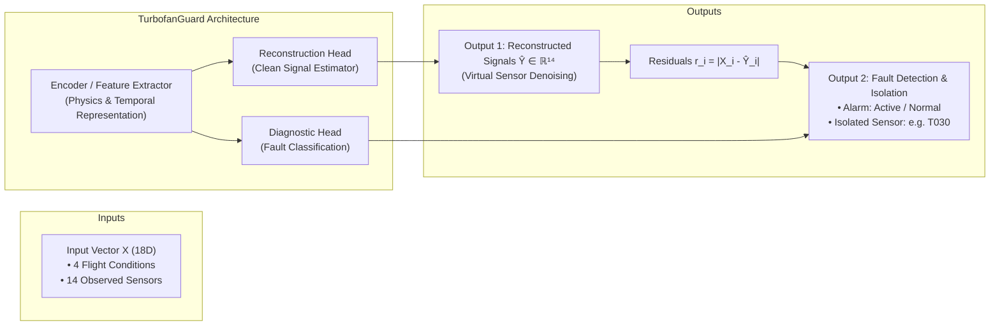
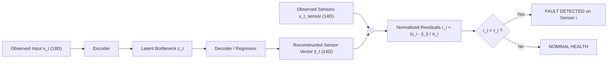
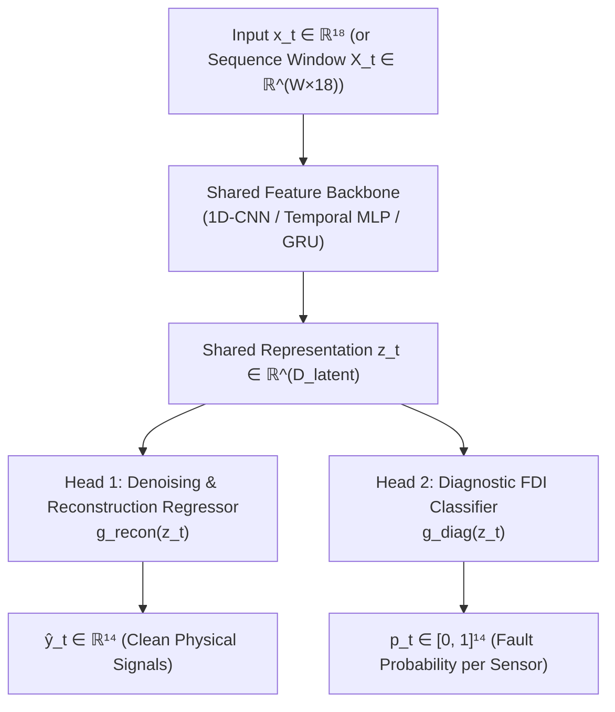
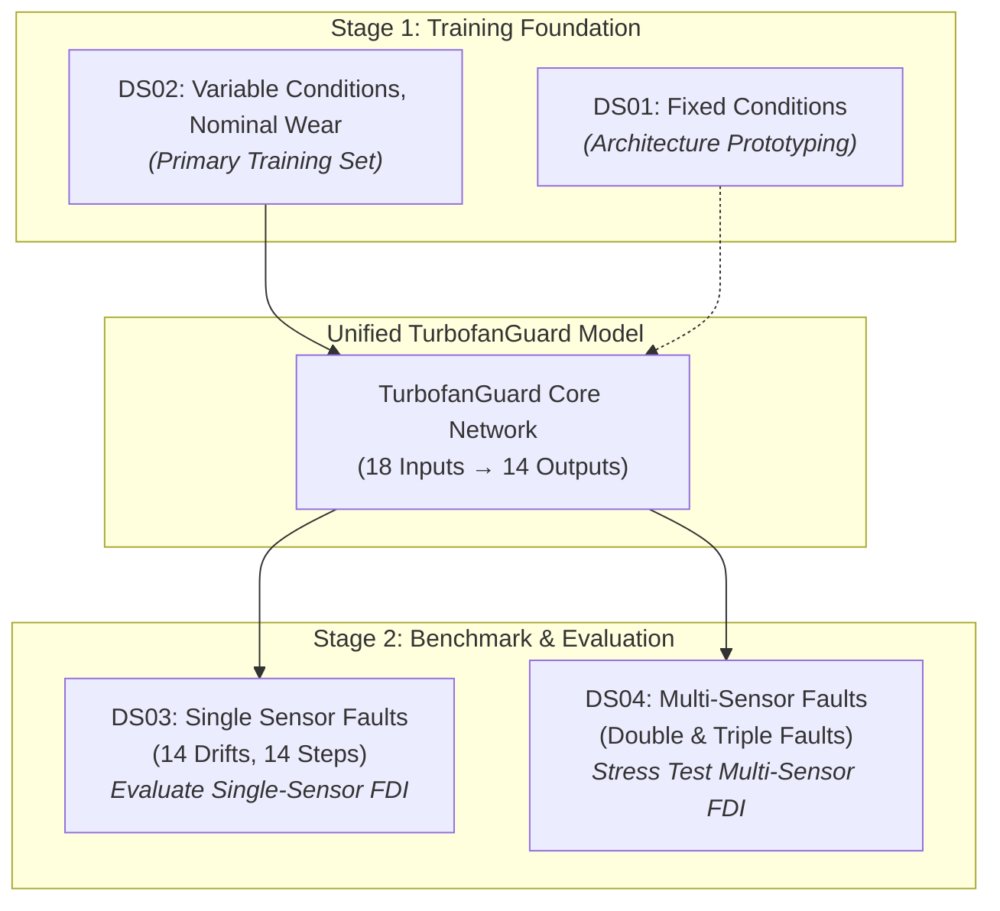

# TurbofanGuard: Machine Learning Architecture Strategy

## 1. Executive Summary & System Vision

**TurbofanGuard** is an end-to-end Fault Detection, Isolation (FDI), and Signal Reconstruction pipeline for turbofan jet engines operating under real-world performance degradation and flight variability.

When deployed on an engine's continuous telemetry stream, the system solves three simultaneous objectives:
1. **Fault Detection**: Determine whether an anomaly or sensor failure has occurred ($\text{Healthy} \to 0, \text{Faulty} \to 1$).
2. **Fault Isolation**: Identify precisely **which** of the 14 sensors is malfunctioning (e.g. *"Sensor $T_{030}$ has a $+2\%$ linear drift"*).
3. **Signal Reconstruction (Virtual Sensing)**: Estimate the clean, uncorrupted thermodynamic truth $\hat{\mathbf{y}}_t \in \mathbb{R}^{14}$ to replace the damaged measurement, allowing the flight control computer and maintenance crew to operate safely.

---

## 2. Mathematical Formulation

### 2.1 Input Feature Space ($\mathbf{x}_t \in \mathbb{R}^{18}$)

At each discrete flight cycle $t \in \{1, \dots, 200\}$, the engine telemetry provides an 18-dimensional vector:

$$\mathbf{x}_t = \begin{bmatrix} \mathbf{c}_t \\ \mathbf{x}_t^{\text{sensor}} \end{bmatrix} \in \mathbb{R}^{18}$$

Where:
1. **Operating Conditions ($\mathbf{c}_t \in \mathbb{R}^4$)**: Defines the thermodynamic ambient environment and pilot command:
   $$\mathbf{c}_t = \begin{bmatrix} \text{ALT}_t & \text{XM}_t & \text{DTISA}_t & \text{EPR}_t \end{bmatrix}^\top$$
   * $\text{ALT}_t$: Altitude (meters)
   * $\text{XM}_t$: Flight Mach number
   * $\text{DTISA}_t$: Temperature deviation from standard atmosphere ($\Delta T_{ISA}$ in Kelvin)
   * $\text{EPR}_t$: Engine Pressure Ratio (throttle command)

2. **Observed Sensor Measurements ($\mathbf{x}_t^{\text{sensor}} \in \mathbb{R}^{14}$)**: Telemetry subject to electrical noise, peak spikes, and potential sensor failures:
   $$\mathbf{x}_t^{\text{sensor}} = \mathbf{y}_t^* + \boldsymbol{\epsilon}_t + \mathbf{f}_t$$
   * $\mathbf{y}_t^* \in \mathbb{R}^{14}$: The true, latent thermodynamic engine state (clean signal).
   * $\boldsymbol{\epsilon}_t \sim \mathcal{N}(\mathbf{0}, \boldsymbol{\Sigma}_t)$: High-frequency Gaussian measurement noise and peak anomalies.
   * $\mathbf{f}_t \in \mathbb{R}^{14}$: Sensor fault injection vector:
     $$\mathbf{f}_t = \mathbf{0} \quad \text{(when healthy)}$$
     $$\mathbf{f}_t[i] = k_i \cdot (t - t_{\text{start}}) \quad \text{(for linear drift fault on sensor } i \text{)}$$
     $$\mathbf{f}_t[i] = b_i \cdot \mathbb{I}(t \ge t_{\text{start}}) \quad \text{(for abrupt step bias on sensor } i \text{)}$$

### 2.2 Target Space

* **Reconstruction Target**: The true clean physics vector $\mathbf{y}_t^* \in \mathbb{R}^{14}$ (`*_truth` channels).
* **Isolation Target**: A multi-hot binary vector $\mathbf{m}_t \in \{0, 1\}^{14}$, where $m_{t, i} = 1$ if sensor $i$ is faulty at flight cycle $t$.

---

## 3. The Two-Step Architectural Strategy

Rather than building an opaque "black-box" model, we adopt a two-step progression that mirrors aerospace industry standards:

---

### Step 1: Baseline Denoising Autoencoder (Physics-Informed Residual FDI)

Step 1 relies on the principle of **Analytical Redundancy**: a model trained on healthy engine behavior can predict what any sensor *ought* to read given the current flight conditions and remaining sensors.

#### 1. Training Phase (Trained on Nominal Data: DS02 / Healthy DS03)
The model learns a non-linear mapping $g_\theta: \mathbb{R}^{18} \to \mathbb{R}^{14}$ by minimizing Mean Squared Error (MSE) against clean ground truth:

$$\mathcal{L}_{\text{recon}}(\theta) = \frac{1}{B} \sum_{b=1}^B \sum_{i=1}^{14} \left( \hat{y}_{b, i} - y_{b, i}^* \right)^2$$

Because the training set contains only nominal degradation and noise (no sensor drift or step bias), the weights $\theta$ capture the thermodynamic manifold of a healthy engine.

#### 2. Inference & Residual Computation
During testing on `DS03` or `DS04`, compute the standardized residual vector $\mathbf{r}_t \in \mathbb{R}^{14}$:

$$r_{t, i} = \frac{|x_{t, i}^{\text{sensor}} - \hat{y}_{t, i}|}{\sigma_{i, \text{nominal}}}$$

Where $\sigma_{i, \text{nominal}}$ is the nominal standard deviation of sensor $i$ under healthy conditions.

#### 3. Fault Detection & Isolation Logic
* **Fault Detection (System Alarm)**:
  $$S_t = \max_{i \in \{1, \dots, 14\}} r_{t, i}$$
  $$\text{Alarm}(t) = \begin{cases} 1 & \text{if } S_t > \tau_{\text{det}} \\ 0 & \text{otherwise} \end{cases}$$
  Where $\tau_{\text{det}}$ is a statistical threshold (typically $3\sigma$ to $4\sigma$ for Gaussian noise).

* **Fault Isolation (Pinpointing the Failed Sensor)**:
  $$\text{Faulty Sensor Index} = \arg\max_{i \in \{1, \dots, 14\}} r_{t, i} \quad \text{for all } i \text{ where } r_{t, i} > \tau_{\text{iso}, i}$$

#### Advantages of Step 1:
* **Completely Unsupervised / Self-Supervised for Faults**: Requires zero prior fault labels during training.
* **Physics-Interpretable**: An engineer can visually inspect the residual plot $r_i(t)$ and see the exact moment a sensor begins drifting.

---

### Step 2: Dual-Head Multi-Task Architecture (Reconstruction + Diagnostic Classifier)

Step 2 augments the baseline by adding a dedicated **Supervised Classification Head**. The network is trained end-to-end to simultaneously denoise signals and classify fault modes.

#### 1. Architecture Components
* **Shared Backbone**: Transforms the 18 input features into a rich latent representation:
  $$\mathbf{z}_t = \text{Backbone}(\mathbf{x}_t) \in \mathbb{R}^{D_{\text{latent}}}$$
  *(Can be an MLP for snapshot data, or a 1D-CNN / GRU for sequence windows $W$).*

* **Head 1: Signal Reconstruction Head**:
  $$\hat{\mathbf{y}}_t = g_{\text{recon}}(\mathbf{z}_t) \in \mathbb{R}^{14}$$

* **Head 2: Diagnostic Classification Head**:
  $$\mathbf{p}_t = \sigma\left( g_{\text{diag}}(\mathbf{z}_t) \right) \in [0, 1]^{14}$$
  Where each $p_{t, i} \in [0, 1]$ is the independent probability that sensor $i$ is faulty at flight cycle $t$, and $\sigma(\cdot)$ is the Sigmoid activation.

#### 2. Multi-Task Joint Loss Function
The model optimizes both tasks simultaneously:

$$\mathcal{L}_{\text{total}} = \mathcal{L}_{\text{recon}} + \lambda \cdot \mathcal{L}_{\text{FDI}}$$

Where:
* **Reconstruction Loss**:
  $$\mathcal{L}_{\text{recon}} = \frac{1}{B \cdot 14} \sum_{b=1}^B \sum_{i=1}^{14} (\hat{y}_{b, i} - y_{b, i}^*)^2$$

* **FDI Classification Loss (Weighted Binary Cross-Entropy)**:
  Because faults occur on a minority of cycles, we apply positive weighting $w_{\text{pos}}$ to handle class imbalance:
  $$\mathcal{L}_{\text{FDI}} = - \frac{1}{B \cdot 14} \sum_{b=1}^B \sum_{i=1}^{14} \left[ w_{\text{pos}} \cdot m_{b, i} \log(p_{b, i}) + (1 - m_{b, i}) \log(1 - p_{b, i}) \right] $$

* **$\lambda$**: Balance hyperparameter (typically $0.5 \le \lambda \le 2.0$) ensuring neither task dominates gradients.

#### Why Step 2 Outperforms Single-Task Models:
* **Shared Inductive Bias**: Learning to reconstruct the clean signal forces the backbone to understand the true physics, which prevents the diagnostic classifier from overfitting to noise artifacts.
* **Redundancy & Double Verification**: A fault is confirmed only if **both** the diagnostic head outputs $p_i > 0.5$ AND the residual $r_i$ exceeds the threshold $\tau_i$, slashing false alarm rates to near zero.

---

## 4. How the 4 Dataset Suites (DS01–DS04) Fit Together

We do **not** train separate models for each suite. Instead, the 4 suites form a **Curriculum Learning & Benchmarking Lifecycle**:

### Dataset Suite Progression Table

| Suite | Operating Conditions | Fault Modes Present | Engine Count | Role in Strategy |
| :--- | :--- | :--- | :--- | :--- |
| **`DS01`** | Fixed (ALT=10,668m, XM=0.78) | None (Noise + degradation only) | 200 | **Prototyping Baseline**: Unit test to verify network convergence without condition variance. |
| **`DS02`** | **Variable** (ALT, Mach, EPR fluctuate) | None (Noise + degradation only) | 200 | **Core Training Engine**: Teaches the model healthy aerodynamics and physics across the entire flight envelope. |
| **`DS03`** | **Variable** | **Single Faults** (14 drift families, 14 step families) | 560 | **Primary FDI Benchmark**: Validates single-fault detection rate, isolation precision, and latency. |
| **`DS04`** | **Variable** | **Multi-Faults** (Double/triple simultaneous faults) | 704 | **Generalization Stress Test**: Evaluates whether the model isolates multiple broken sensors without cross-talk. |

---

## 5. Performance Evaluation Metrics

To rigorously assess TurbofanGuard, we report standard aerospace metrics:

### 1. Denoising & Reconstruction Metrics
* **Root Mean Squared Error (RMSE)**:
  $$\text{RMSE}_i = \sqrt{\frac{1}{N} \sum_{t=1}^N (\hat{y}_{t, i} - y_{t, i}^*)^2}$$
* **Mean Absolute Percentage Error (MAPE)**: Physical reconstruction accuracy in engineering units.

### 2. Fault Detection & Isolation (FDI) Metrics
* **False Alarm Rate (FAR / FPR)**: Percentage of false alarms raised during healthy cycles ($t < t_{\text{start}}$). Target: $< 1.0\%$.
* **True Positive Rate (TPR / Recall)**: Percentage of true faults detected ($t \ge t_{\text{start}}$). Target: $> 95\%$.
* **Detection Latency ($\Delta t_{\text{det}}$)**:
  $$\Delta t_{\text{det}} = t_{\text{first\_alarm}} - t_{\text{fault\_start}}$$
  *(Measures how many flight cycles elapse before a subtle drift is caught).*
* **Isolation Accuracy**:
  $$\text{Acc}_{\text{iso}} = \frac{\text{Correctly Identified Faulty Sensor}}{\text{Total Injected Faults}}$$

---

## 6. Summary Roadmap for Implementation

1. **Phase 2 (Completed)**: Clean data normalization pipeline ([src/data/scaler.py](file:///Users/atulyasharan/Documents/TurbofanGuard/src/data/scaler.py)) using `StandardScaler` and explicit whitelists.
2. **Phase 3**: PyTorch `TurbofanDataset` and batch loaders ([src/data/dataset.py](file:///Users/atulyasharan/Documents/TurbofanGuard/src/data/dataset.py)).
3. **Phase 4**: Step 1 Baseline Model: Autoencoder / Denoising Regressor ([src/models/baseline_ae.py](file:///Users/atulyasharan/Documents/TurbofanGuard/src/models/)).
4. **Phase 5**: Residual FDI evaluation script on `DS03` test set ([scripts/evaluate_fdi.py](file:///Users/atulyasharan/Documents/TurbofanGuard/scripts/)).
5. **Phase 6**: Step 2 Dual-Head Multi-Task Network ([src/models/dual_head_fdi.py](file:///Users/atulyasharan/Documents/TurbofanGuard/src/models/)) tested against `DS04`.
